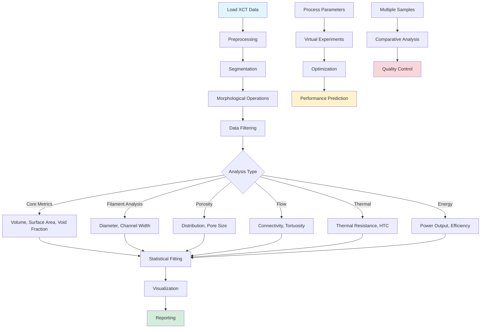

# XCT Thermomagnetic Analysis Framework

[](https://github.com/kanhaiya-gupta/XCT_Thermomagnetic_Analysis)

A comprehensive Python framework for analyzing X-ray Computed Tomography (XCT) images of 3D-printed thermomagnetic elements. This framework enables morphological characterization, defect detection, dimensional analysis, and performance prediction for thermomagnetic generator research.

## 🎯 Overview

This framework is designed to evaluate the morphology of 3D-printed thermomagnetic heat exchanger components. The 3D extrusion and post heat treatment process may introduce defects that impact heat transfer efficiency, magnetic and mechanical properties. XCT image analysis enables:

- **3D Visualization** of 3D-printed structures
- **Scalar Quantity Estimation**: Volume, surface area, void fraction
- **Morphological Analysis**: Filament diameter, channel width, porosity distribution
- **Dimensional Accuracy**: Repeatability and printing process accuracy
- **Flow Analysis**: Connectivity, tortuosity, flow resistance
- **Thermal Analysis**: Heat transfer efficiency, thermal resistance
- **Energy Conversion**: Power output and efficiency estimation

## 📊 Framework Workflow



## 🚀 Quick Start

### Installation

1. **Clone the repository:**
   ```bash
   git clone https://github.com/kanhaiya-gupta/XCT_Thermomagnetic_Analysis.git
   cd XCT_Thermomagnetic_Analysis
   ```

2. **Install dependencies:**
   ```bash
   pip install -r requirements.txt
   ```

### Basic Usage

See [Quick Start Guide](docs/README.md#-quick-start) and [Tutorials](docs/tutorials.md) for detailed examples.

### Interactive Analysis

Use the Jupyter notebooks for interactive analysis:

- **[Notebook Documentation](docs/notebooks.md)** - Complete guide to all interactive notebooks
- **[01: Getting Started](notebooks/01_Getting_Started_Basic_Analysis.ipynb)** - Basic analysis workflow
- **[02: Preprocessing](notebooks/02_Preprocessing_Data_Cleaning.ipynb)** - Data cleaning and filtering
- **[03: Core Analysis](notebooks/03_Core_Analysis_Morphology_Porosity.ipynb)** - Morphology and porosity
- **[04: Experimental Analysis](notebooks/04_Experimental_Analysis_Flow_Thermal_Energy.ipynb)** - Flow, thermal, energy
- **[05: Advanced Analysis](notebooks/05_Advanced_Analysis_Sensitivity_Virtual_Experiments.ipynb)** - Sensitivity and DoE
- **[06: Comparative Analysis](notebooks/06_Comparative_Analysis_Batch_Processing.ipynb)** - Batch processing
- **[07: Quality Control](notebooks/07_Quality_Control_Validation.ipynb)** - Validation and QC
- **[08: Complete Pipeline](notebooks/08_Complete_Analysis_Pipeline.ipynb)** - End-to-end workflow

## 📁 Project Structure

```
XCT_Thermomagnetic_Analysis/
├── README.md                 # This file
├── requirements.txt          # Python dependencies
├── pytest.ini                # Pytest configuration
├── src/                      # Source code (organized by functionality)
│   ├── core/                # Core analysis (segmentation, metrics, etc.)
│   ├── preprocessing/       # Data cleaning and statistics
│   ├── analysis/            # Advanced analysis (sensitivity, DoE, etc.)
│   ├── quality/             # Quality control and validation
│   ├── experimental/        # Experiment-specific (flow, thermal, energy)
│   ├── integration/         # External tool integration (DragonFly)
│   └── utils/               # Utility functions
├── tests/                    # Comprehensive test suite
│   ├── test_core/           # Core module tests
│   ├── test_preprocessing/  # Preprocessing tests
│   ├── test_analysis/       # Advanced analysis tests
│   ├── test_quality/        # Quality control tests
│   ├── test_experimental/   # Experiment-specific tests
│   ├── test_integration/    # Integration tests
│   ├── test_utils/          # Utility tests
│   ├── test_analyzer/       # Main analyzer tests
│   └── fixtures/            # Test data fixtures
├── notebooks/               # Interactive Jupyter notebooks
├── docs/                    # Comprehensive documentation
├── data/                    # Input XCT data
├── outputs/                 # Analysis results
└── data_generation/         # Synthetic data generation
```

## 🔧 Key Features

### Core Analysis
- **Segmentation**: Otsu, multi-threshold, adaptive thresholding
- **Morphology**: Erosion, dilation, skeletonization, hole filling
- **Metrics**: Volume, surface area, void fraction, relative density
- **Filament Analysis**: Diameter estimation, channel width analysis
- **Porosity**: Distribution analysis, pore size, connectivity

### Advanced Analysis
- **Sensitivity Analysis**: Parameter sensitivity, uncertainty quantification
- **Virtual Experiments**: Design of Experiments (DoE), optimization
- **Comparative Analysis**: Batch processing, statistical comparison
- **Performance Analysis**: Heat transfer, magnetic, mechanical properties

### Experiment-Specific
- **Flow Analysis**: Connectivity, tortuosity, flow resistance, pressure drop
- **Thermal Analysis**: Thermal resistance, heat transfer coefficient
- **Energy Conversion**: Power output, efficiency, temperature dependence

### Quality & Validation
- **Dimensional Accuracy**: CAD comparison, tolerance compliance
- **Uncertainty Quantification**: Confidence intervals, uncertainty budgets
- **Validation**: Comparison with DragonFly, ground truth validation
- **Reproducibility**: Configuration management, provenance tracking

## 📚 Documentation

Comprehensive documentation is available in the [`docs/`](docs/) directory:

### Core Documentation
- **[Documentation Index](docs/README.md)** - Complete documentation guide
- **[Architecture](docs/architecture.md)** - Framework architecture and design
- **[Workflows](docs/workflows.md)** - Step-by-step analysis workflows
- **[Module Reference](docs/modules.md)** - Detailed module documentation
- **[API Reference](docs/api.md)** - Complete API documentation

### Guides and Tutorials
- **[Installation Guide](docs/installation.md)** - Setup and installation
- **[Tutorials](docs/tutorials.md)** - Getting started tutorials
- **[Notebooks](docs/notebooks.md)** - Interactive Jupyter notebook documentation
- **[Statistical Fitting](docs/statistical_fitting.md)** - Distribution and regression fitting
- **[Data Generation](docs/data_generation.md)** - Synthetic data generation

### Use Cases
- **[Experimental Use Cases](docs/experimental_use_cases.md)** - Flow, thermal, and energy conversion analysis
- **[Advanced Analysis Use Cases](docs/advanced_analysis_use_cases.md)** - Sensitivity, DoE, comparative analysis
- **[External Tools](docs/external_image_analysis_tools.md)** - Tool integration (DragonFly, ImageJ, etc.)

### Framework Information
- **[Research Alignment](docs/RESEARCH_ALIGNMENT.md)** - Research context and alignment
- **[Module Reference](docs/modules.md)** - Complete module documentation

## 📦 Supported Data Formats

- **DICOM** (.dcm, .dicom) - Medical imaging standard
- **TIFF** (.tif, .tiff) - Multi-page TIFF stacks
- **RAW** (.raw) - Raw binary data
- **NIfTI** (.nii, .nii.gz) - Neuroimaging format
- **MHD/MHA** (.mhd, .mha) - MetaImage format
- **NumPy** (.npy, .npz) - NumPy arrays
- **CSV/Excel** (.csv, .xlsx) - Tabular data with coordinates

See [Module Reference](docs/modules.md) for detailed format specifications.

## 🔄 Unit Handling

The framework automatically handles different unit systems and normalizes to millimeters (default):

- **Micrometers** (µm, um, micrometer)
- **Millimeters** (mm) - **Default**
- **Centimeters** (cm)
- **Meters** (m)

See [Utils Module](docs/modules.md#utils-module) for unit conversion details.

## 🔗 Integration

### DragonFly Integration

Seamless integration with DragonFly software for importing/exporting volumes, segmentation, and results. See [External Tools Documentation](docs/external_image_analysis_tools.md) for details.

### Data Warehouse Integration

Can integrate with the main data warehouse system for loading CT scan data and storing analysis results. See [Architecture Documentation](docs/architecture.md) for integration details.

## 🎓 Research Context

This framework is designed for **thermomagnetic generator research**:

- **Goal**: Convert low-grade waste heat to electricity using Faraday's law
- **Components**: Water-flowable thermomagnetic elements (heat exchangers)
- **Manufacturing**: 3D extrusion + post heat treatment
- **Analysis**: Non-destructive XCT characterization

See [Research Alignment](docs/RESEARCH_ALIGNMENT.md) for detailed research context.

## 📈 Framework Status

The framework is **complete** with 23 modules covering all essential analysis capabilities. See [Module Reference](docs/modules.md) for complete module documentation.

## 🤝 Contributing

See [Contributing Guidelines](docs/contributing.md) for information on contributing to the framework.

## 📄 License

Part of the PBF-LB/M NoSQL Data Warehouse project.

## 📞 Support

For questions, issues, or contributions:
- See the [Documentation Index](docs/README.md) for detailed guides
- Check [Tutorials](docs/tutorials.md) for examples
- Review [API Reference](docs/api.md) for function documentation

---

**Quick Links:**
- [📖 Full Documentation](docs/README.md)
- [🏗️ Architecture](docs/architecture.md)
- [🔬 Use Cases](docs/experimental_use_cases.md)
- [📊 Notebooks Guide](docs/notebooks.md)
- [📓 Notebooks Directory](notebooks/)
