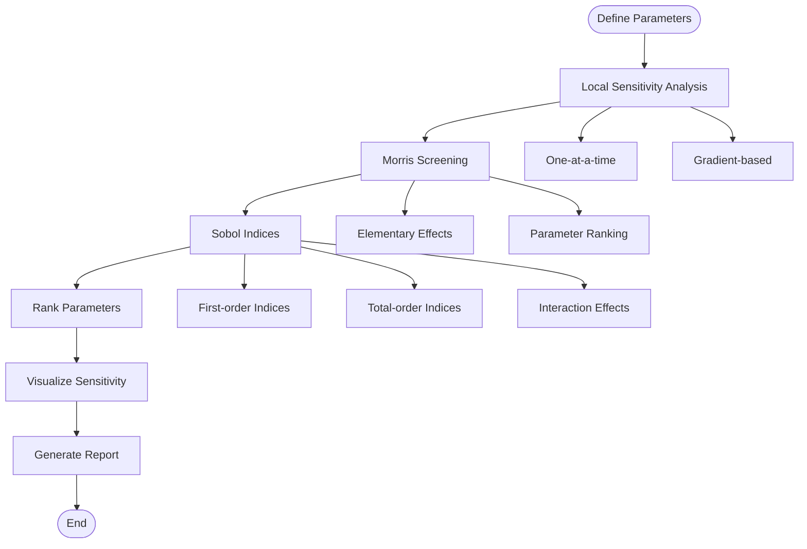
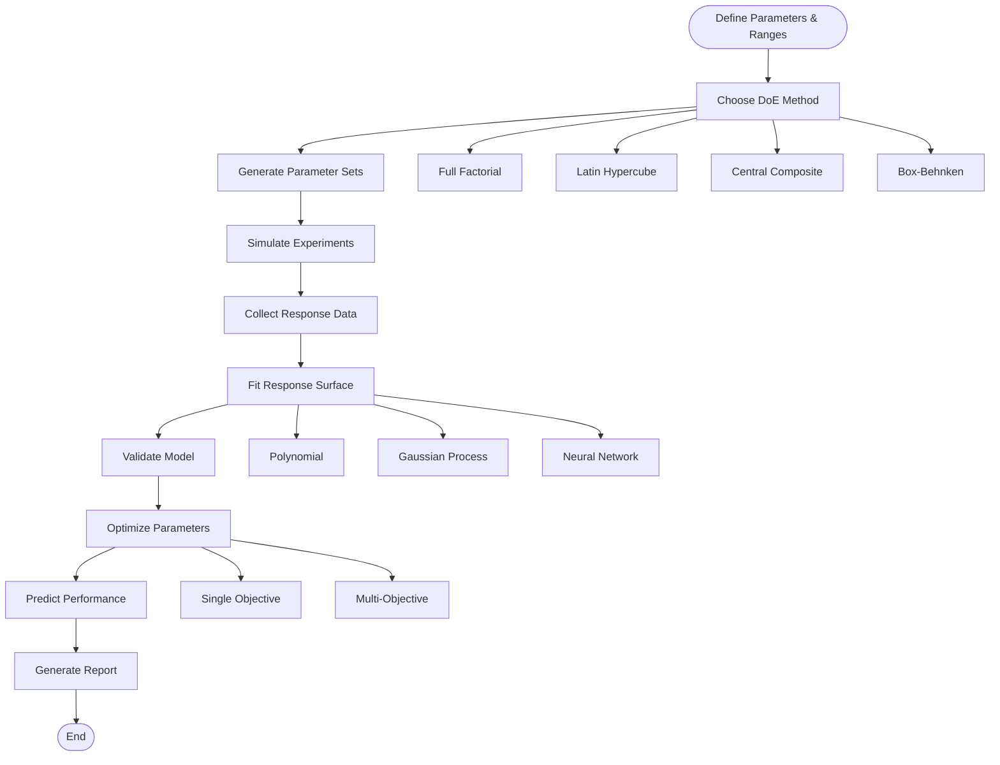
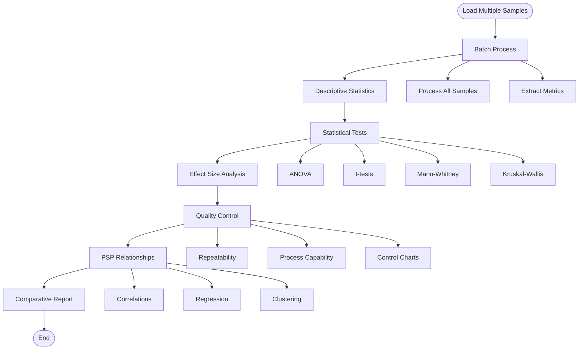
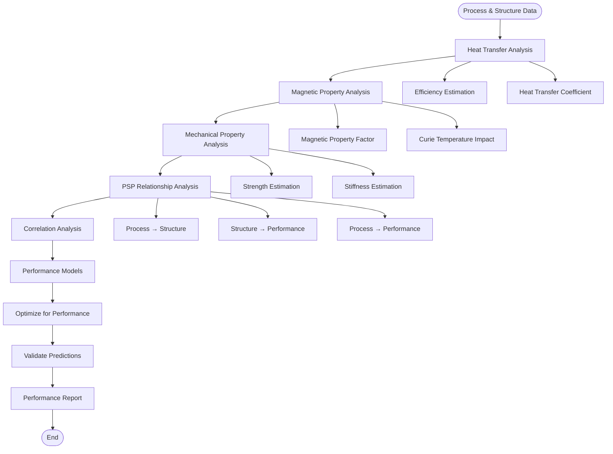
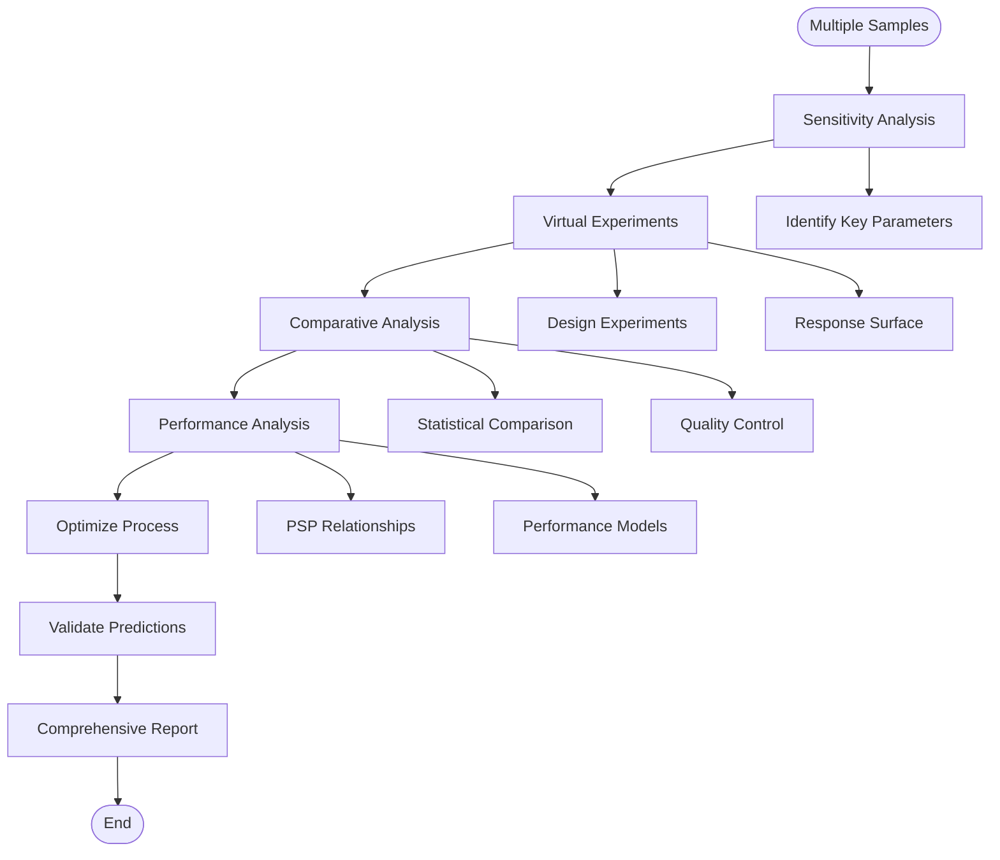

# Advanced Analysis Use Cases

This document describes advanced analysis use cases for research optimization, process understanding, and performance prediction using sensitivity analysis, virtual experiments, comparative analysis, and performance analysis.

## Overview

The advanced analysis modules enable:
- **Sensitivity Analysis**: Understand which parameters most affect results
- **Virtual Experiments**: Design optimal experiments without physical trials
- **Comparative Analysis**: Compare multiple samples statistically
- **Performance Analysis**: Predict performance from structure metrics

## Use Case 1: Parameter Sensitivity Analysis

### Objective
Identify which process parameters and analysis settings have the greatest impact on structure metrics and performance.

### Workflow



### Code Example: Local Sensitivity

```python
from src.analysis.sensitivity_analysis import local_sensitivity
from src.core.metrics import compute_all_metrics
import numpy as np

# Base volume
base_volume = segmented

# Define parameter ranges
parameters = {
    'threshold': {
        'base': 0.4,
        'range': [0.3, 0.5],
        'step': 0.05
    },
    'morphology_kernel': {
        'base': 3,
        'range': [1, 5],
        'step': 1
    }
}

# Analyze sensitivity for void fraction
def compute_void_fraction(volume, threshold, kernel_size):
    from src.core.segmentation import otsu_threshold
    from src.core.morphology import remove_small_objects
    
    # Segment with threshold
    segmented = otsu_threshold(volume)
    
    # Apply morphology
    cleaned = remove_small_objects(segmented, min_size=kernel_size**3)
    
    # Compute void fraction
    metrics = compute_all_metrics(cleaned, (0.1, 0.1, 0.1))
    return metrics['void_fraction']

# Local sensitivity analysis
sensitivity_results = local_sensitivity(
    volume=base_volume,
    parameter='threshold',
    parameter_range=np.linspace(0.3, 0.5, 10),
    metric_function=lambda v, p: compute_void_fraction(v, p, 3)
)

print(f"Parameter: threshold")
print(f"Sensitivity: {sensitivity_results['sensitivity']:.4f}")
print(f"Normalized sensitivity: {sensitivity_results['normalized_sensitivity']:.4f}")

# Visualize
import matplotlib.pyplot as plt
plt.figure(figsize=(10, 6))
plt.plot(sensitivity_results['parameter_values'], 
         sensitivity_results['metric_values'], 'o-')
plt.xlabel('Threshold Value')
plt.ylabel('Void Fraction')
plt.title('Local Sensitivity: Threshold vs Void Fraction')
plt.grid(True)
plt.show()
```

### Code Example: Morris Screening

```python
from src.analysis.sensitivity_analysis import morris_screening

# Multiple parameters
parameters = {
    'threshold': (0.3, 0.5),
    'morphology_kernel': (1, 5),
    'min_object_size': (10, 100)
}

# Morris screening
morris_results = morris_screening(
    volume=base_volume,
    parameters=parameters,
    metric_function=compute_void_fraction,
    n_trajectories=10
)

# Rank parameters by importance
print("Parameter Sensitivity Ranking:")
for param, result in sorted(
    morris_results['elementary_effects'].items(),
    key=lambda x: abs(x[1]['mu_star']),
    reverse=True
):
    print(f"  {param}: μ* = {result['mu_star']:.4f}, σ = {result['sigma']:.4f}")
    if abs(result['mu_star']) > 0.1:
        print(f"    → High sensitivity")
    elif abs(result['mu_star']) > 0.05:
        print(f"    → Moderate sensitivity")
    else:
        print(f"    → Low sensitivity")
```

### Code Example: Sobol Indices

```python
from src.analysis.sensitivity_analysis import sobol_indices

# Sobol indices for comprehensive sensitivity
sobol_results = sobol_indices(
    volume=base_volume,
    parameters=parameters,
    metric_function=compute_void_fraction,
    n_samples=1000
)

print("Sobol Sensitivity Indices:")
print(f"  First-order indices (main effects):")
for param, index in sobol_results['first_order'].items():
    print(f"    {param}: {index:.4f}")

print(f"\n  Total-order indices (including interactions):")
for param, index in sobol_results['total_order'].items():
    print(f"    {param}: {index:.4f}")

print(f"\n  Interaction effects:")
for interaction, index in sobol_results['interactions'].items():
    if index > 0.1:  # Only show significant interactions
        print(f"    {interaction}: {index:.4f}")

# Visualize
import matplotlib.pyplot as plt
fig, axes = plt.subplots(1, 2, figsize=(14, 6))

# First-order indices
params = list(sobol_results['first_order'].keys())
first_order = [sobol_results['first_order'][p] for p in params]
axes[0].barh(params, first_order)
axes[0].set_xlabel('First-Order Sobol Index')
axes[0].set_title('Main Effects')
axes[0].grid(True, alpha=0.3)

# Total-order indices
total_order = [sobol_results['total_order'][p] for p in params]
axes[1].barh(params, total_order)
axes[1].set_xlabel('Total-Order Sobol Index')
axes[1].set_title('Total Effects (Including Interactions)')
axes[1].grid(True, alpha=0.3)

plt.tight_layout()
plt.show()
```

### Interpretation Guidelines

- **High Sensitivity (|μ*| > 0.1 or Sobol > 0.3)**: Parameter significantly affects results
- **Moderate Sensitivity (0.05 < |μ*| < 0.1 or 0.1 < Sobol < 0.3)**: Parameter has moderate effect
- **Low Sensitivity (|μ*| < 0.05 or Sobol < 0.1)**: Parameter has minimal effect

## Use Case 2: Virtual Experiments (Design of Experiments)

### Objective
Design optimal experiments using statistical design methods to minimize physical trials while maximizing information gain.

### Workflow



### Code Example: Full Factorial Design

```python
from src.analysis.virtual_experiments import full_factorial_design, run_virtual_experiment

# Process parameters to optimize
parameters = {
    'extrusion_temp': [200, 220, 240],  # °C
    'print_speed': [20, 30, 40],  # mm/s
    'layer_height': [0.1, 0.15, 0.2]  # mm
}

# Generate full factorial design
design = full_factorial_design(parameters)
print(f"Full factorial design: {len(design)} experiments")
print(design.head())

# Run virtual experiments
def virtual_experiment(params):
    """Simulate experiment with given parameters"""
    # This would typically use a model or surrogate
    # For demonstration, we use a simple function
    temp = params['extrusion_temp']
    speed = params['print_speed']
    height = params['layer_height']
    
    # Simulate void fraction (example relationship)
    void_fraction = 0.4 - 0.001 * temp + 0.002 * speed - 0.5 * height
    void_fraction = max(0.1, min(0.5, void_fraction))  # Clamp
    
    # Simulate power output (example relationship)
    power = 0.05 + 0.0001 * temp - 0.0005 * speed + 0.1 * height
    
    return {
        'void_fraction': void_fraction,
        'power_output': power
    }

# Run all experiments
results = []
for idx, row in design.iterrows():
    result = virtual_experiment(row.to_dict())
    result.update(row.to_dict())
    results.append(result)

results_df = pd.DataFrame(results)
print("\nVirtual Experiment Results:")
print(results_df.head())
```

### Code Example: Latin Hypercube Sampling

```python
from src.analysis.virtual_experiments import latin_hypercube_sampling

# Continuous parameter ranges
parameters = {
    'extrusion_temp': (200, 250),  # °C
    'print_speed': (15, 50),  # mm/s
    'layer_height': (0.08, 0.25)  # mm
}

# Generate LHS design (more efficient than full factorial)
n_samples = 50
lhs_design = latin_hypercube_sampling(parameters, n_samples=n_samples)

print(f"LHS design: {len(lhs_design)} samples")
print(f"Parameter ranges covered efficiently")

# Run virtual experiments
results = []
for params in lhs_design:
    result = virtual_experiment({
        'extrusion_temp': params[0],
        'print_speed': params[1],
        'layer_height': params[2]
    })
    results.append(result)

results_df = pd.DataFrame(results)
```

### Code Example: Response Surface Modeling

```python
from src.analysis.virtual_experiments import fit_response_surface

# Fit response surface to virtual experiment data
response_surface = fit_response_surface(
    data=results_df,
    inputs=['extrusion_temp', 'print_speed', 'layer_height'],
    outputs=['void_fraction', 'power_output'],
    model_type='polynomial',  # or 'gaussian_process', 'neural_network'
    degree=2  # For polynomial
)

print("Response Surface Model:")
print(f"  R² (void_fraction): {response_surface['void_fraction']['r_squared']:.4f}")
print(f"  R² (power_output): {response_surface['power_output']['r_squared']:.4f}")

# Predict for new parameter set
new_params = {
    'extrusion_temp': 230,
    'print_speed': 35,
    'layer_height': 0.12
}

prediction = response_surface['power_output']['model'].predict([[
    new_params['extrusion_temp'],
    new_params['print_speed'],
    new_params['layer_height']
]])

print(f"\nPredicted power output: {prediction[0]:.4f} W")
```

### Code Example: Process Optimization

```python
from src.analysis.virtual_experiments import optimize_process_parameters

# Single-objective optimization: maximize power output
optimal_single = optimize_process_parameters(
    response_surface=response_surface,
    objective='maximize_power_output',
    constraints={
        'void_fraction': ('<', 0.3),  # Void fraction must be < 0.3
        'extrusion_temp': ((200, 250)),  # Temperature bounds
        'print_speed': ((15, 50))  # Speed bounds
    }
)

print("Optimal Parameters (Single Objective):")
print(f"  Extrusion Temperature: {optimal_single['extrusion_temp']:.1f} °C")
print(f"  Print Speed: {optimal_single['print_speed']:.1f} mm/s")
print(f"  Layer Height: {optimal_single['layer_height']:.3f} mm")
print(f"  Predicted Power Output: {optimal_single['power_output']:.4f} W")

# Multi-objective optimization: maximize power, minimize void fraction
from src.analysis.virtual_experiments import multi_objective_optimization

optimal_multi = multi_objective_optimization(
    response_surface=response_surface,
    objectives={
        'power_output': 'maximize',
        'void_fraction': 'minimize'
    },
    constraints={
        'extrusion_temp': ((200, 250)),
        'print_speed': ((15, 50)),
        'layer_height': ((0.08, 0.25))
    }
)

print("\nPareto Front (Multi-Objective):")
for i, solution in enumerate(optimal_multi['pareto_front'][:5]):
    print(f"\nSolution {i+1}:")
    print(f"  Parameters: {solution['parameters']}")
    print(f"  Power Output: {solution['power_output']:.4f} W")
    print(f"  Void Fraction: {solution['void_fraction']:.4f}")
```

## Use Case 3: Comparative Analysis

### Objective
Statistically compare multiple samples to identify significant differences, batch effects, and process variability.

### Workflow



### Code Example: Batch Processing

```python
from src.analysis.comparative_analysis import batch_analyze, compare_samples

# Analyze multiple samples
sample_paths = [
    'data/sample_01.dcm',
    'data/sample_02.dcm',
    'data/sample_03.dcm',
    'data/sample_04.dcm',
    'data/sample_05.dcm'
]

# Batch analysis
batch_results = batch_analyze(
    volume_paths=sample_paths,
    voxel_size=(0.1, 0.1, 0.1),
    analysis_config={
        'compute_metrics': True,
        'compute_porosity': True,
        'compute_filament': True
    }
)

print(f"Analyzed {len(batch_results)} samples")
print("\nBatch Results Summary:")
print(batch_results[['sample_name', 'void_fraction', 'relative_density']].head())
```

### Code Example: Statistical Comparison

```python
from src.analysis.comparative_analysis import statistical_tests
import pandas as pd

# Group samples by condition
group1 = batch_results[batch_results['batch'] == 'A']['void_fraction']
group2 = batch_results[batch_results['batch'] == 'B']['void_fraction']

# t-test
t_test = statistical_tests(group1, group2, test_type='t-test')
print("t-test Results:")
print(f"  t-statistic: {t_test['statistic']:.4f}")
print(f"  p-value: {t_test['p_value']:.4f}")
print(f"  Significant: {t_test['p_value'] < 0.05}")

# Mann-Whitney U test (non-parametric)
mw_test = statistical_tests(group1, group2, test_type='mann-whitney')
print("\nMann-Whitney U Test:")
print(f"  U-statistic: {mw_test['statistic']:.4f}")
print(f"  p-value: {mw_test['p_value']:.4f}")

# ANOVA for multiple groups
from scipy import stats
groups = [
    batch_results[batch_results['batch'] == 'A']['void_fraction'],
    batch_results[batch_results['batch'] == 'B']['void_fraction'],
    batch_results[batch_results['batch'] == 'C']['void_fraction']
]
f_stat, p_value = stats.f_oneway(*groups)
print(f"\nANOVA:")
print(f"  F-statistic: {f_stat:.4f}")
print(f"  p-value: {p_value:.4f}")
```

### Code Example: Quality Control Analysis

```python
from src.analysis.comparative_analysis import compare_samples

# Compare samples with quality metrics
comparison = compare_samples(
    samples=batch_results,
    metrics=['void_fraction', 'relative_density', 'mean_filament_diameter'],
    group_by='batch'
)

print("Quality Control Analysis:")
print(f"\nRepeatability (within-batch CV):")
for metric in ['void_fraction', 'relative_density']:
    cv = comparison['repeatability'][metric]['cv']
    print(f"  {metric}: {cv:.4f} ({'Good' if cv < 0.1 else 'Acceptable' if cv < 0.2 else 'Poor'})")

print(f"\nProcess Capability:")
for metric in ['void_fraction', 'relative_density']:
    cp = comparison['process_capability'][metric]['cp']
    print(f"  {metric}: Cp = {cp:.2f} ({'Capable' if cp > 1.33 else 'Marginal' if cp > 1.0 else 'Incapable'})")
```

## Use Case 4: Performance Analysis

### Objective
Predict performance (heat transfer, magnetic, mechanical) from structure metrics and establish Process-Structure-Performance relationships.

### Workflow



### Code Example: Performance Estimation

```python
from src.analysis.performance_analysis import (
    estimate_heat_transfer_efficiency,
    estimate_magnetic_property_impact,
    estimate_mechanical_property_impact
)

# Structure metrics from XCT analysis
structure_metrics = {
    'void_fraction': 0.25,
    'relative_density': 0.75,
    'specific_surface_area': 500.0,  # mm²/mm³
    'mean_channel_width': 1.0,  # mm
    'mean_filament_diameter': 0.8  # mm
}

# Estimate heat transfer efficiency
heat_efficiency = estimate_heat_transfer_efficiency(structure_metrics)
print(f"Heat Transfer Efficiency: {heat_efficiency['efficiency']:.3f}")
print(f"  Factors:")
print(f"    Surface area contribution: {heat_efficiency['surface_area_factor']:.3f}")
print(f"    Channel geometry contribution: {heat_efficiency['channel_geometry_factor']:.3f}")

# Estimate magnetic property impact
magnetic_impact = estimate_magnetic_property_impact(structure_metrics)
print(f"\nMagnetic Property Impact: {magnetic_impact['impact_factor']:.3f}")
print(f"  Factors:")
print(f"    Density contribution: {magnetic_impact['density_factor']:.3f}")
print(f"    Structure contribution: {magnetic_impact['structure_factor']:.3f}")

# Estimate mechanical property impact
mechanical_impact = estimate_mechanical_property_impact(structure_metrics)
print(f"\nMechanical Property Impact:")
print(f"  Strength factor: {mechanical_impact['strength_factor']:.3f}")
print(f"  Stiffness factor: {mechanical_impact['stiffness_factor']:.3f}")
```

### Code Example: PSP Relationship Analysis

```python
from src.analysis.performance_analysis import process_structure_performance_relationship

# Process parameters
process_params = pd.DataFrame({
    'sample_name': ['S01', 'S02', 'S03', 'S04', 'S05'],
    'extrusion_temp': [200, 220, 240, 230, 210],
    'print_speed': [20, 30, 40, 25, 35],
    'layer_height': [0.1, 0.15, 0.2, 0.12, 0.18]
})

# Structure metrics (from XCT)
structure_metrics = pd.DataFrame({
    'sample_name': ['S01', 'S02', 'S03', 'S04', 'S05'],
    'void_fraction': [0.30, 0.25, 0.20, 0.27, 0.22],
    'relative_density': [0.70, 0.75, 0.80, 0.73, 0.78],
    'mean_channel_width': [0.8, 1.0, 1.2, 0.9, 1.1],
    'specific_surface_area': [400, 500, 600, 450, 550]
})

# Performance metrics (from experiments)
performance_metrics = pd.DataFrame({
    'sample_name': ['S01', 'S02', 'S03', 'S04', 'S05'],
    'heat_transfer_efficiency': [0.60, 0.70, 0.80, 0.65, 0.75],
    'magnetic_property_factor': [0.65, 0.75, 0.85, 0.70, 0.80],
    'mechanical_strength': [80, 90, 100, 85, 95]
})

# Analyze PSP relationships
psp_analysis = process_structure_performance_relationship(
    process_params.set_index('sample_name'),
    structure_metrics.set_index('sample_name'),
    performance_metrics.set_index('sample_name')
)

print("Process-Structure-Performance Relationships:")
print(f"\nKey Correlations (Top 10):")
for corr_name, corr_value in sorted(
    psp_analysis['correlations'].items(),
    key=lambda x: abs(x[1]),
    reverse=True
)[:10]:
    strength = "Strong" if abs(corr_value) > 0.7 else "Moderate" if abs(corr_value) > 0.3 else "Weak"
    print(f"  {corr_name}: {corr_value:.4f} ({strength})")

# Visualize key relationships
import matplotlib.pyplot as plt
import seaborn as sns

fig, axes = plt.subplots(2, 2, figsize=(14, 10))

# Process → Structure
ax = axes[0, 0]
ax.scatter(process_params['extrusion_temp'], structure_metrics['void_fraction'], s=100)
ax.set_xlabel('Extrusion Temperature (°C)')
ax.set_ylabel('Void Fraction')
ax.set_title('Process → Structure')
ax.grid(True, alpha=0.3)

# Structure → Performance (Heat Transfer)
ax = axes[0, 1]
ax.scatter(structure_metrics['void_fraction'], performance_metrics['heat_transfer_efficiency'], s=100)
ax.set_xlabel('Void Fraction')
ax.set_ylabel('Heat Transfer Efficiency')
ax.set_title('Structure → Performance (Heat Transfer)')
ax.grid(True, alpha=0.3)

# Structure → Performance (Magnetic)
ax = axes[1, 0]
ax.scatter(structure_metrics['relative_density'], performance_metrics['magnetic_property_factor'], s=100)
ax.set_xlabel('Relative Density')
ax.set_ylabel('Magnetic Property Factor')
ax.set_title('Structure → Performance (Magnetic)')
ax.grid(True, alpha=0.3)

# Correlation heatmap
ax = axes[1, 1]
all_data = pd.concat([
    process_params.set_index('sample_name'),
    structure_metrics.set_index('sample_name'),
    performance_metrics.set_index('sample_name')
], axis=1)
corr_matrix = all_data.corr()
sns.heatmap(corr_matrix, annot=True, fmt='.3f', cmap='coolwarm', center=0, ax=ax, square=True)
ax.set_title('PSP Correlation Matrix')

plt.tight_layout()
plt.show()
```

### Code Example: Performance Optimization

```python
from src.analysis.performance_analysis import optimize_for_performance

# Optimize for maximum heat transfer efficiency
optimal = optimize_for_performance(
    psp_relationship=psp_analysis,
    objective='maximize_heat_transfer_efficiency',
    constraints={
        'void_fraction': ('>', 0.2),  # Minimum void fraction
        'relative_density': ('>', 0.7),  # Minimum density
        'extrusion_temp': ((200, 250))  # Temperature bounds
    }
)

print("Optimal Parameters for Maximum Heat Transfer Efficiency:")
print(f"  Extrusion Temperature: {optimal['extrusion_temp']:.1f} °C")
print(f"  Print Speed: {optimal['print_speed']:.1f} mm/s")
print(f"  Layer Height: {optimal['layer_height']:.3f} mm")
print(f"\nPredicted Structure:")
print(f"  Void Fraction: {optimal['predicted_void_fraction']:.3f}")
print(f"  Relative Density: {optimal['predicted_relative_density']:.3f}")
print(f"\nPredicted Performance:")
print(f"  Heat Transfer Efficiency: {optimal['predicted_heat_transfer_efficiency']:.3f}")
```

## Use Case 5: Integrated Advanced Analysis Workflow

### Objective
Complete workflow combining sensitivity analysis, virtual experiments, comparative analysis, and performance prediction.

### Workflow



### Code Example: Complete Workflow

```python
# Step 1: Sensitivity Analysis
print("=" * 60)
print("STEP 1: Sensitivity Analysis")
print("=" * 60)

sobol_results = sobol_indices(
    volume=base_volume,
    parameters=parameters,
    metric_function=compute_void_fraction,
    n_samples=500
)

key_parameters = [
    p for p, idx in sobol_results['total_order'].items() 
    if idx > 0.2  # Focus on parameters with high sensitivity
]
print(f"Key parameters: {key_parameters}")

# Step 2: Virtual Experiments
print("\n" + "=" * 60)
print("STEP 2: Virtual Experiments")
print("=" * 60)

# Use key parameters for DoE
key_param_ranges = {k: parameters[k] for k in key_parameters}
lhs_design = latin_hypercube_sampling(key_param_ranges, n_samples=30)

# Run virtual experiments
virtual_results = []
for params in lhs_design:
    result = virtual_experiment(dict(zip(key_parameters, params)))
    virtual_results.append(result)

# Fit response surface
response_surface = fit_response_surface(
    data=pd.DataFrame(virtual_results),
    inputs=key_parameters,
    outputs=['void_fraction', 'power_output']
)

# Step 3: Comparative Analysis
print("\n" + "=" * 60)
print("STEP 3: Comparative Analysis")
print("=" * 60)

batch_results = batch_analyze(sample_paths, voxel_size=(0.1, 0.1, 0.1))
comparison = compare_samples(batch_results, metrics=['void_fraction', 'relative_density'])

# Step 4: Performance Analysis
print("\n" + "=" * 60)
print("STEP 4: Performance Analysis")
print("=" * 60)

psp_analysis = process_structure_performance_relationship(
    process_params.set_index('sample_name'),
    structure_metrics.set_index('sample_name'),
    performance_metrics.set_index('sample_name')
)

# Step 5: Optimization
print("\n" + "=" * 60)
print("STEP 5: Optimization")
print("=" * 60)

optimal = optimize_for_performance(
    psp_relationship=psp_analysis,
    objective='maximize_heat_transfer_efficiency',
    constraints={'void_fraction': ('>', 0.2)}
)

print("Optimal Process Parameters:")
for param, value in optimal.items():
    if param.startswith('predicted'):
        continue
    print(f"  {param}: {value}")

# Step 6: Validation
print("\n" + "=" * 60)
print("STEP 6: Validation")
print("=" * 60)

# Compare predictions with actual results
validation_samples = batch_results[batch_results['sample_name'].isin(['S01', 'S02'])]
for _, sample in validation_samples.iterrows():
    predicted = response_surface['void_fraction']['model'].predict([[
        sample['extrusion_temp'],
        sample['print_speed'],
        sample['layer_height']
    ]])
    actual = sample['void_fraction']
    error = abs(predicted[0] - actual) / actual * 100
    print(f"Sample {sample['sample_name']}:")
    print(f"  Predicted: {predicted[0]:.3f}, Actual: {actual:.3f}")
    print(f"  Error: {error:.1f}%")
```

## Best Practices

### 1. Start with Sensitivity Analysis
```python
# Always identify key parameters first
sensitivity = sobol_indices(...)
key_params = [p for p, idx in sensitivity['total_order'].items() if idx > 0.2]
```

### 2. Use Appropriate DoE Method
- **Full Factorial**: Small number of parameters (< 4), discrete levels
- **LHS**: Continuous parameters, efficient sampling
- **CCD/BBD**: Response surface optimization

### 3. Validate Models
```python
# Always validate response surface models
if response_surface['r_squared'] < 0.8:
    print("Warning: Low R² - model may not be reliable")
```

### 4. Consider Uncertainty
```python
# Include uncertainty in predictions
from src.quality.uncertainty_analysis import monte_carlo_uncertainty

uncertainty = monte_carlo_uncertainty(
    analysis_function=optimize_for_performance,
    uncertainties={'extrusion_temp': 0.05},  # 5% uncertainty
    n_samples=1000
)
```

### 5. Document Everything
```python
# Use reproducibility framework
from src.quality.reproducibility import track_analysis_provenance

provenance = track_analysis_provenance(
    analysis_type='sensitivity_analysis',
    parameters=parameters,
    results=sobol_results
)
```

## Integration with Other Modules

Advanced analysis integrates with:
- **Core modules**: For computing metrics
- **Experimental modules**: For performance prediction
- **Quality modules**: For uncertainty and validation
- **Preprocessing**: For data cleaning

See [Workflows](workflows.md) for more integration examples.

