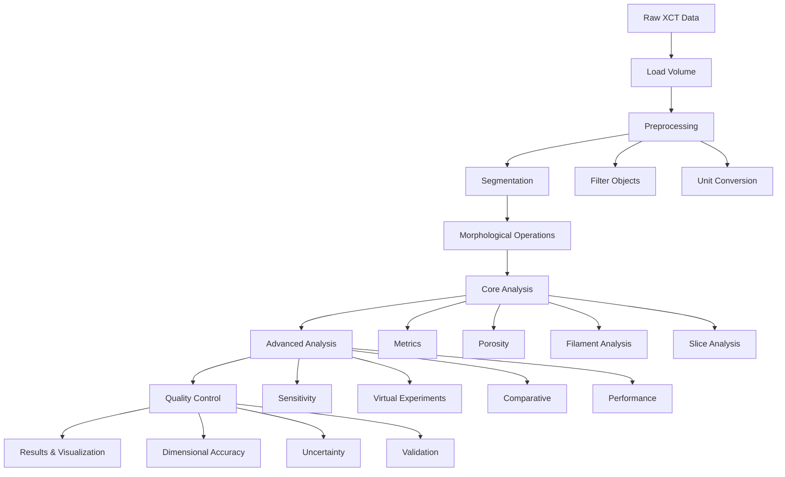
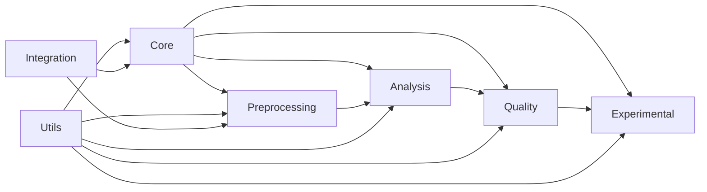

# Architecture Overview

## Framework Architecture

The XCT Thermomagnetic Analysis Framework follows a modular, hierarchical architecture designed for extensibility and maintainability.

## Package Structure

```mermaid
graph TB
    subgraph "XCT Analysis Framework"
        A[src/] --> B[core/]
        A --> C[preprocessing/]
        A --> D[analysis/]
        A --> E[quality/]
        A --> F[experimental/]
        A --> G[integration/]
        A --> H[utils/]
        A --> I[analyzer.py]
    end
    
    B --> B1[segmentation]
    B --> B2[morphology]
    B --> B3[metrics]
    B --> B4[filament_analysis]
    B --> B5[porosity]
    B --> B6[slice_analysis]
    B --> B7[visualization]
    
    C --> C1[preprocessing]
    C --> C2[statistics]
    
    D --> D1[sensitivity_analysis]
    D --> D2[virtual_experiments]
    D --> D3[comparative_analysis]
    D --> D4[performance_analysis]
    
    E --> E1[dimensional_accuracy]
    E --> E2[uncertainty_analysis]
    E --> E3[reproducibility]
    E --> E4[validation]
    
    F --> F1[flow_analysis]
    F --> F2[thermal_analysis]
    F --> F3[energy_conversion]
    
    G --> G1[dragonfly_integration]
    
    H --> H1[utils]
```



## Module Categories

### 1. Core Modules (`src/core/`)

Fundamental analysis operations that form the foundation of the framework.

**Modules:**
- `segmentation.py` - Image segmentation (Otsu, adaptive, multi-threshold)
- `morphology.py` - Morphological operations (erosion, dilation, skeletonization)
- `metrics.py` - Scalar metrics (volume, surface area, void fraction)
- `filament_analysis.py` - Filament diameter and channel width estimation
- `porosity.py` - Porosity distribution analysis
- `slice_analysis.py` - Slice analysis along/perpendicular to flow
- `visualization.py` - 3D visualization and plotting

### 2. Preprocessing Modules (`src/preprocessing/`)

Data cleaning, filtering, and statistical analysis.

**Modules:**
- `preprocessing.py` - Data filtering and object property analysis
- `statistics.py` - Statistical fitting and analysis (Gaussian, Poisson, etc.)

### 3. Analysis Modules (`src/analysis/`)

Advanced analysis capabilities for research and optimization.

**Modules:**
- `sensitivity_analysis.py` - Parameter sensitivity analysis
- `virtual_experiments.py` - Design of Experiments (DoE) and optimization
- `comparative_analysis.py` - Batch processing and statistical comparison
- `performance_analysis.py` - Process-Structure-Performance relationships

### 4. Quality Modules (`src/quality/`)

Quality control, validation, and reproducibility.

**Modules:**
- `dimensional_accuracy.py` - Dimensional accuracy and tolerance analysis
- `uncertainty_analysis.py` - Uncertainty quantification
- `reproducibility.py` - Reproducibility framework and provenance tracking
- `validation.py` - Validation against ground truth and other tools

### 5. Experimental Modules (`src/experimental/`)

Experiment-specific analysis for thermomagnetic generator research.

**Modules:**
- `flow_analysis.py` - Flow path connectivity, tortuosity, resistance
- `thermal_analysis.py` - Thermal resistance and heat transfer
- `energy_conversion.py` - Energy conversion efficiency and power output

### 6. Integration Modules (`src/integration/`)

External tool integration.

**Modules:**
- `dragonfly_integration.py` - DragonFly software integration

### 7. Utils (`src/utils/`)

Utility functions for I/O and data conversion.

**Modules:**
- `utils.py` - File I/O, unit conversion, data loading/saving

## Data Flow



## Design Principles

### 1. Modularity
Each module is self-contained with a specific purpose. Modules can be used independently or combined.

### 2. Hierarchical Organization
Modules are organized by functionality into logical categories, making it easy to find and use relevant functions.

### 3. Extensibility
New modules can be added without modifying existing code. The framework is designed to grow.

### 4. Reproducibility
Built-in reproducibility framework ensures analyses can be reproduced exactly.

### 5. Validation
Comprehensive validation framework ensures results are accurate and reliable.

## Main Analyzer Class

The `XCTAnalyzer` class provides a unified interface that integrates all modules:

```python
from src.analyzer import XCTAnalyzer

analyzer = XCTAnalyzer(voxel_size=(0.1, 0.1, 0.1))
results = analyzer.analyze_comprehensive(volume)
```

The analyzer orchestrates the complete analysis pipeline from data loading to result generation.

## Dependencies



## Extension Points

The framework is designed to be extended:

1. **New Analysis Modules** - Add to `src/analysis/` or `src/experimental/`
2. **New Quality Checks** - Add to `src/quality/`
3. **New Integrations** - Add to `src/integration/`
4. **New Visualizations** - Extend `src/core/visualization.py`

See [Contributing Guide](contributing.md) for details.

