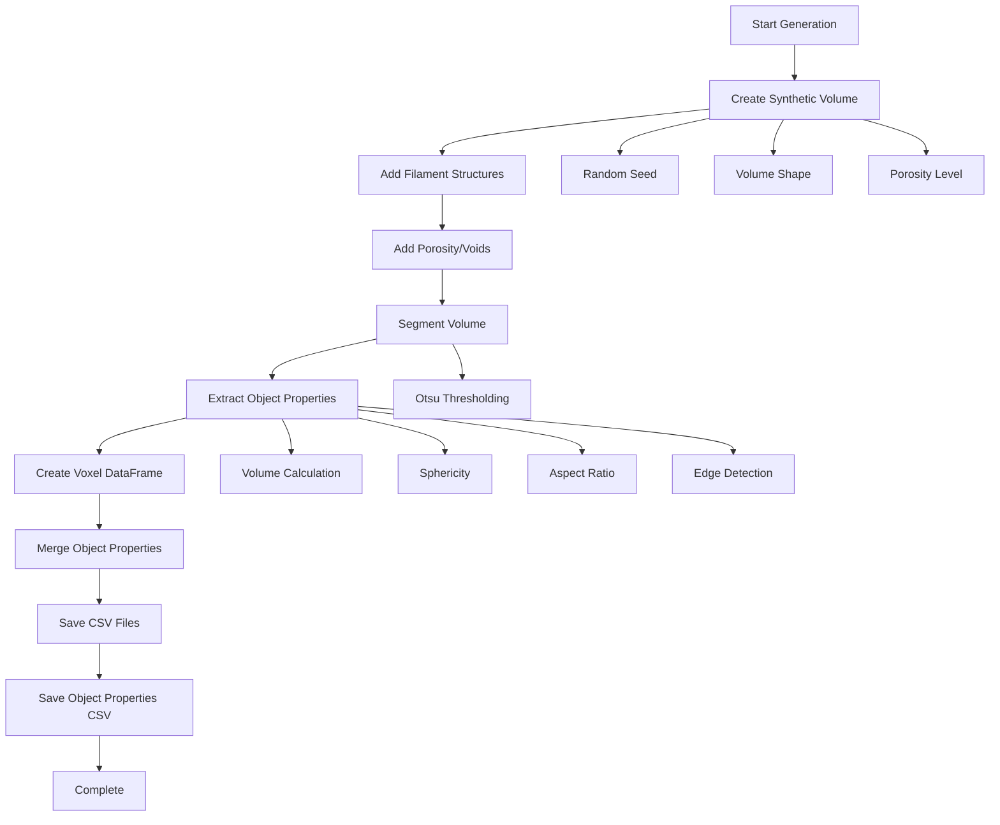

# Data Generation Guide

This document provides comprehensive guidance on generating synthetic XCT data for testing, demonstration, and development purposes.

## Overview

The data generation module creates realistic synthetic XCT segmented data that mimics real thermomagnetic element structures. This is useful for:

- **Testing**: Validate analysis workflows without real data
- **Demonstration**: Show framework capabilities with sample data
- **Development**: Test new features and algorithms
- **Education**: Learn framework usage with known data

## Quick Start

### Generate Sample Data

```bash
cd XCT_Thermomagnetic_Analysis/data_generation
python generate_segmented_data.py
```

This creates 10 sample segmented data CSV files in `data/segmented_data/`.

### Load Generated Data

```python
from src.utils.utils import load_segmented_data

# Load a generated sample
volume, metadata = load_segmented_data(
    'data/segmented_data/Sample_01_segmented.csv'
)

print(f"Volume shape: {volume.shape}")
print(f"Voxel size: {metadata['voxel_size']} mm")
```

## Data Generation Script

### Location

```
XCT_Thermomagnetic_Analysis/
└── data_generation/
    └── generate_segmented_data.py
```

### Functionality

The script generates:

1. **Synthetic 3D volumes** with realistic structures
2. **Segmented data** using Otsu thresholding
3. **Voxel-level CSV files** with coordinates and values
4. **Object-level properties** (volume, sphericity, aspect ratio, etc.)

## Workflow Diagram



## Synthetic Volume Generation

### Structure Features

The synthetic volumes include:

1. **Filament-like structures**
   - Cylindrical structures along z-axis
   - Random positions and radii
   - Simulates 3D-printed filaments

2. **Porosity/Voids**
   - Randomly distributed pores
   - Variable sizes
   - Configurable porosity level

3. **Realistic noise**
   - Random variations
   - Simulates XCT imaging artifacts

### Parameters

```python
def create_synthetic_volume(
    shape: Tuple[int, int, int],  # (z, y, x) dimensions
    seed: int = None,              # Random seed for reproducibility
    porosity_level: float = 0.3    # Target porosity (0.0 to 1.0)
) -> np.ndarray:
```

**Example:**

```python
from data_generation.generate_segmented_data import create_synthetic_volume

# Create a 100x100x100 volume with 30% porosity
volume = create_synthetic_volume(
    shape=(100, 100, 100),
    seed=42,
    porosity_level=0.3
)
```

## Generated File Format

### Voxel-Level CSV

Each generated CSV file contains:

**Required Columns:**
- `x`, `y`, `z`: Physical coordinates (mm)
- `x_voxel`, `y_voxel`, `z_voxel`: Voxel indices
- `value`: Segmented value (0 or 1)
- `segmented`: Alias for value
- `sample_name`: Sample identifier

**Object Properties (if included):**
- `object_id`: Unique object identifier
- `object_volume_mm3`: Object volume in mm³
- `object_sphericity`: Sphericity (0-1, 1 = perfect sphere)
- `object_max_aspect_ratio`: Maximum aspect ratio
- `object_on_edge`: Whether object touches volume edge (boolean)

**Example CSV Structure:**

```csv
x,y,z,x_voxel,y_voxel,z_voxel,value,segmented,sample_name,object_id,object_volume_mm3,object_sphericity,object_max_aspect_ratio,object_on_edge
0.0,0.0,0.0,0,0,0,1,1,Sample_01,1,0.125,0.85,1.2,True
0.1,0.0,0.0,1,0,0,1,1,Sample_01,1,0.125,0.85,1.2,True
...
```

### Object-Level CSV

Separate file with object properties:

**File naming:** `{sample_name}_objects.csv`

**Columns:**
- `label_id`: Object label (same as object_id)
- `volume_mm3`: Object volume
- `sphericity`: Sphericity metric
- `max_aspect_ratio`: Maximum aspect ratio
- `min_aspect_ratio`: Minimum aspect ratio
- `on_edge`: Edge detection flag
- `centroid_x`, `centroid_y`, `centroid_z`: Object centroid
- `sample_name`: Sample identifier

## Customization

### Modify Generation Parameters

Edit `generate_segmented_data.py`:

```python
# In main() function, modify:
n_samples = 20  # Generate 20 samples instead of 10
volume_shape = (150, 150, 150)  # Larger volumes
voxel_size = (0.05, 0.05, 0.05)  # Finer resolution (50 µm)

# Vary porosity levels
porosity_levels = np.linspace(0.1, 0.6, n_samples)  # Wider range
```

### Custom Volume Generation

Create your own volume generator:

```python
def create_custom_volume(shape, **kwargs):
    """Custom volume generation function"""
    volume = np.zeros(shape)
    
    # Add your custom structures
    # ... your code ...
    
    return volume

# Use in generation
volume = create_custom_volume(volume_shape, **custom_params)
```

### Modify Output Format

Customize the CSV generation:

```python
def generate_segmented_csv(
    volume,
    voxel_size,
    output_path,
    sample_name,
    include_object_properties=True,
    custom_columns=None  # Add custom columns
):
    # ... existing code ...
    
    # Add custom columns
    if custom_columns:
        for col_name, col_values in custom_columns.items():
            df_voxels[col_name] = col_values
```

## Complete Example

### Generate and Analyze

```python
import numpy as np
from pathlib import Path
from data_generation.generate_segmented_data import (
    create_synthetic_volume,
    generate_segmented_csv
)
from src.core.metrics import compute_all_metrics
from src.preprocessing.statistics import fit_gaussian

# 1. Generate synthetic volume
volume = create_synthetic_volume(
    shape=(100, 100, 100),
    seed=42,
    porosity_level=0.3
)

# 2. Generate CSV file
output_path = Path('data/segmented_data/custom_sample.csv')
generate_segmented_csv(
    volume,
    voxel_size=(0.1, 0.1, 0.1),
    output_path=output_path,
    sample_name='Custom_Sample',
    include_object_properties=True
)

# 3. Load and analyze
from src.utils.utils import load_segmented_data
volume_loaded, metadata = load_segmented_data(str(output_path))

# 4. Compute metrics
metrics = compute_all_metrics(volume_loaded, metadata['voxel_size'])
print(f"Void fraction: {metrics['void_fraction']:.3f}")
print(f"Relative density: {metrics['relative_density']:.3f}")

# 5. Analyze object properties
import pandas as pd
objects_df = pd.read_csv(output_path.parent / 'custom_sample_objects.csv')
print(f"\nNumber of objects: {len(objects_df)}")
print(f"Average sphericity: {objects_df['sphericity'].mean():.3f}")

# 6. Fit distribution to object volumes
volumes = objects_df['volume_mm3'].values
fit = fit_gaussian(volumes)
print(f"\nVolume distribution:")
print(f"  Mean: {fit['mean']:.3f} mm³")
print(f"  Std: {fit['std']:.3f} mm³")
```

## Batch Generation

### Generate Multiple Samples with Variations

```python
from data_generation.generate_segmented_data import (
    create_synthetic_volume,
    generate_segmented_csv
)
from pathlib import Path
import numpy as np

# Parameters
n_samples = 20
output_dir = Path('data/segmented_data')
output_dir.mkdir(parents=True, exist_ok=True)

# Generate with different parameters
for i in range(n_samples):
    # Vary porosity
    porosity = 0.2 + (i / n_samples) * 0.3  # 0.2 to 0.5
    
    # Vary volume size
    size_factor = 80 + i * 2  # 80 to 118
    shape = (size_factor, size_factor, size_factor)
    
    # Create volume
    volume = create_synthetic_volume(
        shape=shape,
        seed=42 + i,
        porosity_level=porosity
    )
    
    # Generate CSV
    sample_name = f"Batch_Sample_{i+1:02d}"
    output_file = output_dir / f"{sample_name}_segmented.csv"
    
    generate_segmented_csv(
        volume,
        voxel_size=(0.1, 0.1, 0.1),
        output_path=output_file,
        sample_name=sample_name,
        include_object_properties=True
    )
    
    print(f"Generated: {sample_name} (porosity={porosity:.2f}, size={shape})")
```

## Integration with Analysis

### Use in Notebooks

The generated data works seamlessly with all notebooks:

```python
# In 01_XCT_Data_Explorer.ipynb
from src.utils.utils import load_segmented_data

# Load generated data
volume, metadata = load_segmented_data(
    'data/segmented_data/Sample_01_segmented.csv'
)

# Use in analysis
from src.core.metrics import compute_all_metrics
metrics = compute_all_metrics(volume, metadata['voxel_size'])
```

### Use in Batch Processing

```python
# In 03_Comparative_Analysis_Batch_Processing.ipynb
from src.analysis.comparative_analysis import batch_analyze
from pathlib import Path

# Get all generated samples
data_dir = Path('data/segmented_data')
csv_files = list(data_dir.glob('*_segmented.csv'))

# Batch analyze
results = batch_analyze(
    file_paths=csv_files,
    analysis_config={
        'compute_metrics': True,
        'compute_porosity': True,
        'compute_filament_analysis': True
    }
)
```

## File Structure

### Generated Files

```
data/
└── segmented_data/
    ├── Sample_01_segmented.csv          # Voxel-level data
    ├── Sample_01_objects.csv           # Object properties
    ├── Sample_02_segmented.csv
    ├── Sample_02_objects.csv
    └── ...
```

### File Sizes

Typical file sizes (for 100×100×100 volumes):
- Voxel CSV: ~5-10 MB (depends on porosity)
- Object CSV: ~10-50 KB (depends on number of objects)

## Advanced Usage

### Generate with Specific Characteristics

```python
def generate_high_porosity_sample():
    """Generate sample with high porosity"""
    volume = create_synthetic_volume(
        shape=(100, 100, 100),
        seed=42,
        porosity_level=0.6  # High porosity
    )
    return volume

def generate_low_porosity_sample():
    """Generate sample with low porosity"""
    volume = create_synthetic_volume(
        shape=(100, 100, 100),
        seed=42,
        porosity_level=0.1  # Low porosity
    )
    return volume

def generate_fine_resolution_sample():
    """Generate sample with fine resolution"""
    volume = create_synthetic_volume(
        shape=(200, 200, 200),  # Larger volume
        seed=42,
        porosity_level=0.3
    )
    return volume
```

### Add Custom Metadata

```python
def generate_with_metadata(volume, voxel_size, sample_name):
    """Generate CSV with custom metadata"""
    # Generate standard CSV
    generate_segmented_csv(
        volume, voxel_size, output_path, sample_name
    )
    
    # Add metadata file
    metadata = {
        'sample_name': sample_name,
        'generation_date': '2024-01-01',
        'porosity_level': 0.3,
        'volume_shape': volume.shape,
        'voxel_size': voxel_size,
        'n_voxels': np.sum(volume > 0)
    }
    
    import json
    metadata_file = output_path.parent / f"{sample_name}_metadata.json"
    with open(metadata_file, 'w') as f:
        json.dump(metadata, f, indent=2)
```

## Validation

### Verify Generated Data

```python
import pandas as pd
from src.utils.utils import load_segmented_data

# Load generated data
volume, metadata = load_segmented_data(
    'data/segmented_data/Sample_01_segmented.csv'
)

# Verify structure
assert volume.shape == (100, 100, 100), "Wrong volume shape"
assert len(metadata['voxel_size']) == 3, "Wrong voxel size format"
assert np.all(volume >= 0) and np.all(volume <= 1), "Invalid values"

# Verify CSV
df = pd.read_csv('data/segmented_data/Sample_01_segmented.csv')
assert 'x' in df.columns, "Missing x column"
assert 'y' in df.columns, "Missing y column"
assert 'z' in df.columns, "Missing z column"
assert 'segmented' in df.columns, "Missing segmented column"

print("✅ All validations passed!")
```

## Troubleshooting

### Problem: Import Errors

**Solution:** Ensure you're running from the correct directory:

```python
import sys
from pathlib import Path

# Add XCT_Thermomagnetic_Analysis root to path
script_dir = Path(__file__).parent
analysis_root = script_dir.parent
sys.path.insert(0, str(analysis_root))
```

### Problem: Memory Issues with Large Volumes

**Solution:** Generate smaller volumes or process in chunks:

```python
# Use smaller volumes
volume_shape = (50, 50, 50)  # Instead of (200, 200, 200)

# Or generate in chunks
for chunk in range(n_chunks):
    volume = create_synthetic_volume(
        shape=(50, 50, 50),
        seed=42 + chunk
    )
    # Process chunk...
```

### Problem: Object Properties Not Generated

**Solution:** Check that `include_object_properties=True`:

```python
generate_segmented_csv(
    volume,
    voxel_size,
    output_path,
    sample_name,
    include_object_properties=True  # Make sure this is True
)
```

## Best Practices

### 1. Use Seeds for Reproducibility

```python
# Always use seeds for reproducible generation
volume = create_synthetic_volume(
    shape=(100, 100, 100),
    seed=42,  # Fixed seed
    porosity_level=0.3
)
```

### 2. Document Generation Parameters

```python
# Save generation parameters
generation_params = {
    'shape': (100, 100, 100),
    'seed': 42,
    'porosity_level': 0.3,
    'voxel_size': (0.1, 0.1, 0.1)
}

# Save to file
import json
with open('generation_params.json', 'w') as f:
    json.dump(generation_params, f, indent=2)
```

### 3. Validate Before Use

Always validate generated data before using in analysis:

```python
# Check data integrity
assert volume.shape == expected_shape
assert np.all(np.isfinite(volume))
assert volume.min() >= 0 and volume.max() <= 1
```

### 4. Organize Generated Data

```python
# Organize by experiment/batch
experiment_dir = Path('data/experiment_01')
experiment_dir.mkdir(parents=True, exist_ok=True)

# Generate with organized naming
for batch in ['A', 'B', 'C']:
    for sample in range(10):
        sample_name = f"Batch_{batch}_Sample_{sample+1:02d}"
        output_path = experiment_dir / f"{sample_name}_segmented.csv"
        # ... generate ...
```

## Summary

The data generation module provides:

✅ **Synthetic volume creation** with realistic structures  
✅ **Automatic segmentation** using Otsu thresholding  
✅ **Voxel-level CSV export** with all required columns  
✅ **Object property extraction** (volume, sphericity, etc.)  
✅ **Batch generation** support  
✅ **Customization** options for different use cases  
✅ **Integration** with all analysis modules  

**Use cases:**
- Testing analysis workflows
- Demonstrating framework capabilities
- Developing new features
- Educational purposes
- Benchmarking algorithms

**Generated files:**
- Voxel-level CSV: `{sample_name}_segmented.csv`
- Object properties CSV: `{sample_name}_objects.csv`

For more information, see the `generate_segmented_data.py` script in the `data_generation/` directory.

