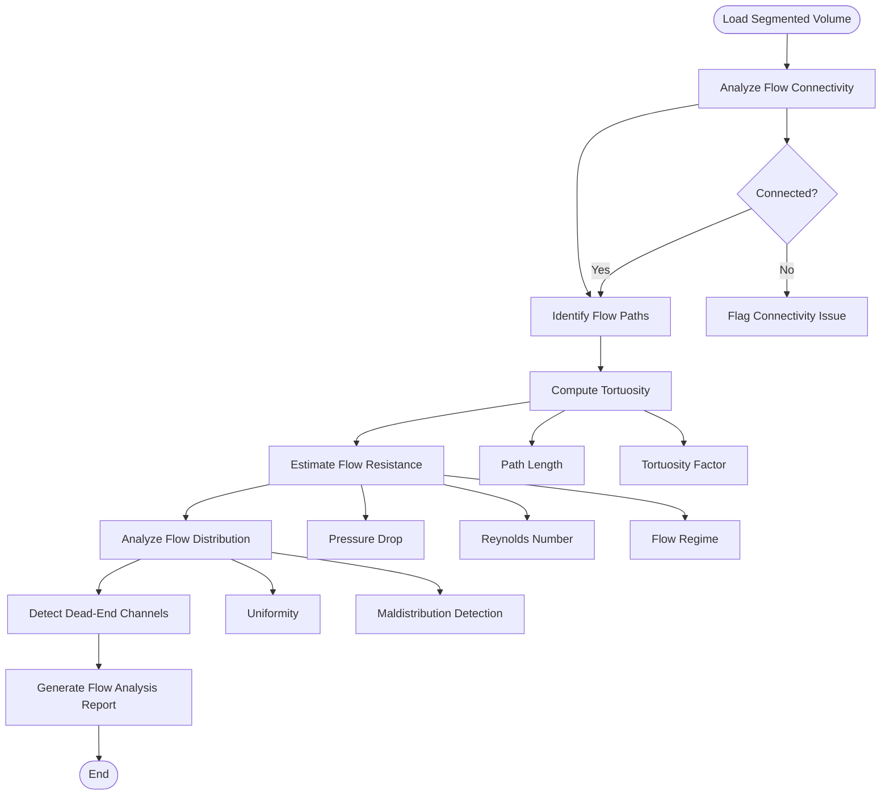
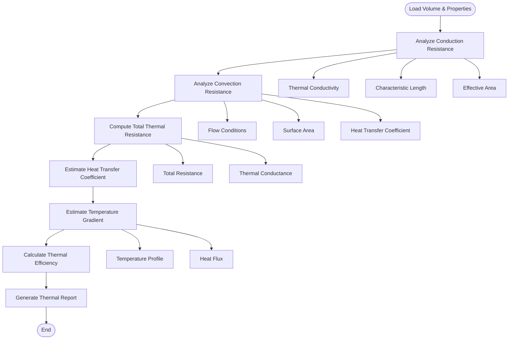
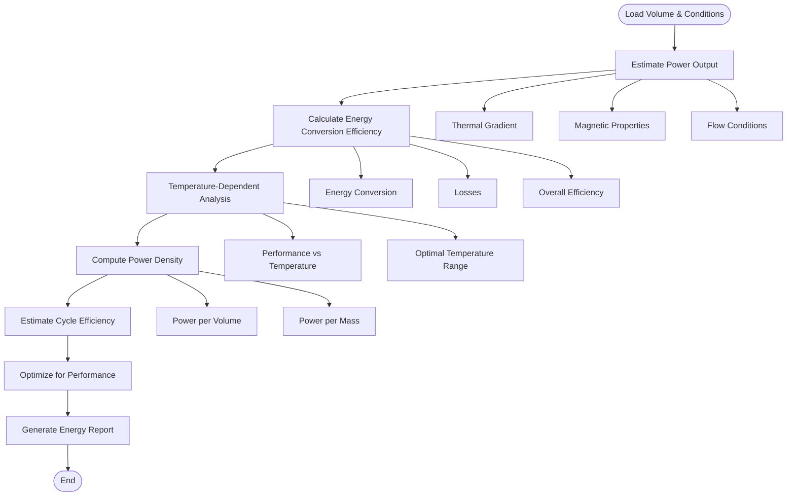
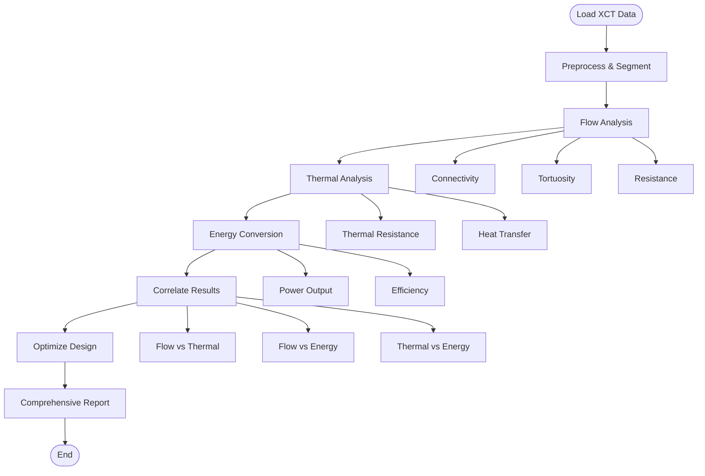
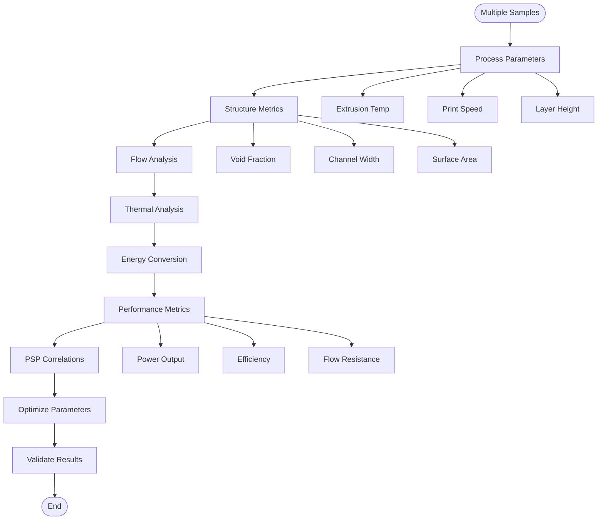

# Experimental Use Cases

This document describes experimental use cases specific to thermomagnetic generator research, focusing on water-flowable thermomagnetic elements used as heat exchanger components.

## Research Context

**Goal**: Convert low-grade waste heat into electricity through thermomagnetic generators based on Faraday's law of induction.

**Components**: Water-flowable thermomagnetic elements used as heat exchanger components in the demonstrator.

**Challenges**: 3D extrusion and post heat treatment may introduce defects affecting:
- Heat transfer efficiency
- Magnetic properties
- Mechanical properties

**Solution**: XCT image analysis to evaluate morphology and identify trends for performance improvement.

## Use Case 1: Flow Path Analysis

### Objective
Analyze water flow characteristics through 3D-printed channels to ensure proper flow distribution and minimize pressure drop.

### Workflow



### Code Example

```python
from src.experimental.flow_analysis import (
    analyze_flow_connectivity,
    compute_tortuosity,
    estimate_flow_resistance,
    analyze_flow_distribution,
    detect_dead_end_channels,
    comprehensive_flow_analysis
)

# Comprehensive flow analysis
flow_results = comprehensive_flow_analysis(
    volume=segmented,
    flow_direction='z',  # Water flows along z-axis
    channel_geometry={'mean_diameter': 1.0},  # mm
    flow_conditions={'velocity': 0.1, 'flow_rate': 0.001},  # m/s, m³/s
    voxel_size=(0.1, 0.1, 0.1)  # mm
)

# Check connectivity
if not flow_results['connectivity']['is_connected']:
    print("⚠️ Warning: Flow path not fully connected!")
    print(f"   Number of disconnected regions: {flow_results['connectivity']['n_disconnected']}")

# Analyze tortuosity
tortuosity = flow_results['tortuosity']['tortuosity']
print(f"Tortuosity: {tortuosity:.3f}")
if tortuosity > 1.5:
    print("⚠️ High tortuosity - may increase flow resistance")

# Check flow resistance
pressure_drop = flow_results['flow_resistance']['pressure_drop_kpa']
print(f"Pressure drop: {pressure_drop:.2f} kPa")
if pressure_drop > 10.0:
    print("⚠️ High pressure drop - may require higher pump power")

# Analyze distribution
uniformity = flow_results['flow_distribution']['uniformity']
print(f"Flow uniformity: {uniformity:.3f}")
if uniformity < 0.8:
    print("⚠️ Flow maldistribution detected - may cause hot spots")
```

### Key Metrics

- **Connectivity**: Ensures water can flow from inlet to outlet
- **Tortuosity**: Measures path complexity (lower is better)
- **Flow Resistance**: Pressure drop across the element
- **Flow Distribution**: Uniformity of flow across channels
- **Dead-End Channels**: Channels that don't contribute to flow

### Interpretation

- **Tortuosity < 1.2**: Excellent - minimal flow resistance
- **Tortuosity 1.2-1.5**: Good - acceptable flow resistance
- **Tortuosity > 1.5**: Poor - high flow resistance, may need redesign

- **Uniformity > 0.9**: Excellent - uniform flow distribution
- **Uniformity 0.7-0.9**: Acceptable - minor maldistribution
- **Uniformity < 0.7**: Poor - significant maldistribution, may cause hot spots

## Use Case 2: Thermal Performance Analysis

### Objective
Evaluate heat transfer characteristics to optimize thermal efficiency of the heat exchanger.

### Workflow



### Code Example

```python
from src.experimental.thermal_analysis import (
    compute_thermal_resistance,
    analyze_conduction_resistance,
    analyze_convection_resistance,
    estimate_heat_transfer_coefficient,
    estimate_temperature_gradient,
    comprehensive_thermal_analysis
)

# Material properties (example: steel-based thermomagnetic material)
material_properties = {
    'thermal_conductivity': 50.0,  # W/m·K
    'density': 7850.0,  # kg/m³
    'specific_heat': 500.0  # J/kg·K
}

# Flow conditions
flow_conditions = {
    'velocity': 0.1,  # m/s
    'flow_rate': 0.001  # m³/s
}

# Comprehensive thermal analysis
thermal_results = comprehensive_thermal_analysis(
    volume=segmented,
    material_properties=material_properties,
    flow_conditions=flow_conditions,
    voxel_size=(0.1, 0.1, 0.1)
)

# Analyze thermal resistance
total_resistance = thermal_results['total_resistance']['total_resistance']
print(f"Total thermal resistance: {total_resistance:.4f} K/W")
if total_resistance > 0.1:
    print("⚠️ High thermal resistance - may limit heat transfer")

# Check heat transfer coefficient
h = thermal_results['total_resistance']['heat_transfer_coefficient']
print(f"Heat transfer coefficient: {h:.1f} W/m²·K")
if h < 100:
    print("⚠️ Low heat transfer coefficient - may need flow optimization")

# Estimate temperature gradient
gradient_results = estimate_temperature_gradient(
    volume=segmented,
    heat_flux=1000.0,  # W/m²
    thermal_properties=material_properties,
    voxel_size=(0.1, 0.1, 0.1)
)

print(f"Temperature gradient: {gradient_results['temperature_gradient']:.2f} K/m")
```

### Key Metrics

- **Thermal Resistance**: Total resistance to heat flow (lower is better)
- **Heat Transfer Coefficient**: Effectiveness of heat transfer (higher is better)
- **Temperature Gradient**: Temperature change per unit length
- **Thermal Conductance**: Inverse of resistance (higher is better)

### Interpretation

- **Thermal Resistance < 0.05 K/W**: Excellent - efficient heat transfer
- **Thermal Resistance 0.05-0.1 K/W**: Good - acceptable heat transfer
- **Thermal Resistance > 0.1 K/W**: Poor - limited heat transfer

- **Heat Transfer Coefficient > 500 W/m²·K**: Excellent - forced convection
- **Heat Transfer Coefficient 100-500 W/m²·K**: Good - moderate convection
- **Heat Transfer Coefficient < 100 W/m²·K**: Poor - weak convection

## Use Case 3: Energy Conversion Efficiency

### Objective
Estimate power output and energy conversion efficiency of the thermomagnetic generator.

### Workflow



### Code Example

```python
from src.experimental.energy_conversion import (
    estimate_power_output,
    calculate_energy_conversion_efficiency,
    analyze_temperature_dependent_performance,
    compute_power_density,
    estimate_cycle_efficiency,
    comprehensive_energy_conversion_analysis
)

# Operating conditions
operating_conditions = {
    'hot_temperature': 80.0,  # °C
    'cold_temperature': 20.0,  # °C
    'flow_rate': 0.001,  # m³/s
    'magnetic_field_strength': 0.5  # T
}

# Material properties
material_properties = {
    'curie_temperature': 100.0,  # °C
    'magnetic_susceptibility': 1000.0,
    'thermal_conductivity': 50.0  # W/m·K
}

# Comprehensive energy conversion analysis
energy_results = comprehensive_energy_conversion_analysis(
    volume=segmented,
    operating_conditions=operating_conditions,
    material_properties=material_properties,
    voxel_size=(0.1, 0.1, 0.1)
)

# Power output
power = energy_results['power_output']['power_output']
print(f"Power output: {power:.3f} W")
if power < 0.1:
    print("⚠️ Low power output - may need optimization")

# Energy conversion efficiency
efficiency = energy_results['efficiency']['energy_conversion_efficiency']
print(f"Energy conversion efficiency: {efficiency:.2%}")
if efficiency < 0.05:
    print("⚠️ Low efficiency - may need material or design improvements")

# Power density
power_density = energy_results['power_density']['power_density']
print(f"Power density: {power_density:.2f} W/m³")

# Temperature-dependent performance
temp_range = np.linspace(20, 100, 10)  # °C
temp_performance = analyze_temperature_dependent_performance(
    volume=segmented,
    temperature_range=temp_range,
    operating_conditions=operating_conditions,
    material_properties=material_properties,
    voxel_size=(0.1, 0.1, 0.1)
)

# Find optimal temperature
optimal_temp_idx = np.argmax(temp_performance['power_output'])
optimal_temp = temp_range[optimal_temp_idx]
print(f"Optimal operating temperature: {optimal_temp:.1f} °C")
```

### Key Metrics

- **Power Output**: Electrical power generated (W)
- **Energy Conversion Efficiency**: Percentage of thermal energy converted to electrical
- **Power Density**: Power per unit volume (W/m³)
- **Cycle Efficiency**: Efficiency over complete thermal cycle
- **Optimal Temperature**: Temperature for maximum power output

### Interpretation

- **Efficiency > 5%**: Excellent - competitive with other waste heat recovery
- **Efficiency 2-5%**: Good - acceptable for low-grade waste heat
- **Efficiency < 2%**: Poor - may need significant improvements

- **Power Density > 1000 W/m³**: Excellent - compact design
- **Power Density 100-1000 W/m³**: Good - reasonable power density
- **Power Density < 100 W/m³**: Poor - may need larger volume

## Use Case 4: Integrated Analysis Workflow

### Objective
Complete analysis workflow combining flow, thermal, and energy conversion analysis.

### Workflow



### Code Example

```python
from src.analyzer import XCTAnalyzer
from src.experimental.flow_analysis import comprehensive_flow_analysis
from src.experimental.thermal_analysis import comprehensive_thermal_analysis
from src.experimental.energy_conversion import comprehensive_energy_conversion_analysis
import pandas as pd

# Initialize analyzer
analyzer = XCTAnalyzer(voxel_size=(0.1, 0.1, 0.1))

# Load and segment
volume, metadata = analyzer.load_volume('data/sample.dcm')
segmented = analyzer.segment_volume(volume)

# 1. Flow Analysis
flow_results = comprehensive_flow_analysis(
    volume=segmented,
    flow_direction='z',
    channel_geometry={'mean_diameter': 1.0},
    flow_conditions={'velocity': 0.1, 'flow_rate': 0.001},
    voxel_size=(0.1, 0.1, 0.1)
)

# 2. Thermal Analysis
thermal_results = comprehensive_thermal_analysis(
    volume=segmented,
    material_properties={
        'thermal_conductivity': 50.0,
        'density': 7850.0,
        'specific_heat': 500.0
    },
    flow_conditions={'velocity': 0.1, 'flow_rate': 0.001},
    voxel_size=(0.1, 0.1, 0.1)
)

# 3. Energy Conversion Analysis
energy_results = comprehensive_energy_conversion_analysis(
    volume=segmented,
    operating_conditions={
        'hot_temperature': 80.0,
        'cold_temperature': 20.0,
        'flow_rate': 0.001,
        'magnetic_field_strength': 0.5
    },
    material_properties={
        'curie_temperature': 100.0,
        'magnetic_susceptibility': 1000.0,
        'thermal_conductivity': 50.0
    },
    voxel_size=(0.1, 0.1, 0.1)
)

# 4. Correlate Results
results_summary = {
    'flow_tortuosity': flow_results['tortuosity']['tortuosity'],
    'flow_pressure_drop_kpa': flow_results['flow_resistance']['pressure_drop_kpa'],
    'thermal_resistance_kw': thermal_results['total_resistance']['total_resistance'],
    'heat_transfer_coefficient': thermal_results['total_resistance']['heat_transfer_coefficient'],
    'power_output_w': energy_results['power_output']['power_output'],
    'efficiency_percent': energy_results['efficiency']['energy_conversion_efficiency'] * 100
}

# 5. Generate Report
print("=" * 60)
print("COMPREHENSIVE EXPERIMENTAL ANALYSIS REPORT")
print("=" * 60)
print(f"\nFlow Analysis:")
print(f"  Tortuosity: {results_summary['flow_tortuosity']:.3f}")
print(f"  Pressure Drop: {results_summary['flow_pressure_drop_kpa']:.2f} kPa")
print(f"\nThermal Analysis:")
print(f"  Thermal Resistance: {results_summary['thermal_resistance_kw']:.4f} K/W")
print(f"  Heat Transfer Coefficient: {results_summary['heat_transfer_coefficient']:.1f} W/m²·K")
print(f"\nEnergy Conversion:")
print(f"  Power Output: {results_summary['power_output_w']:.3f} W")
print(f"  Efficiency: {results_summary['efficiency_percent']:.2f}%")

# 6. Identify Optimization Opportunities
if results_summary['flow_tortuosity'] > 1.5:
    print("\n⚠️ Optimization: Reduce tortuosity to improve flow")
if results_summary['thermal_resistance_kw'] > 0.1:
    print("⚠️ Optimization: Reduce thermal resistance to improve heat transfer")
if results_summary['efficiency_percent'] < 5.0:
    print("⚠️ Optimization: Improve energy conversion efficiency")
```

## Use Case 5: Process-Structure-Performance Optimization

### Objective
Optimize 3D printing process parameters to maximize energy conversion performance.

### Workflow



### Code Example

```python
from src.analysis.performance_analysis import process_structure_performance_relationship
from src.analysis.virtual_experiments import optimize_process_parameters
import pandas as pd

# Process parameters for multiple samples
process_params = pd.DataFrame({
    'sample_name': ['Sample_01', 'Sample_02', 'Sample_03', 'Sample_04'],
    'extrusion_temp': [200, 220, 240, 230],
    'print_speed': [20, 30, 40, 25],
    'layer_height': [0.1, 0.15, 0.2, 0.12]
})

# Structure metrics (from XCT analysis)
structure_metrics = pd.DataFrame({
    'sample_name': ['Sample_01', 'Sample_02', 'Sample_03', 'Sample_04'],
    'void_fraction': [0.30, 0.25, 0.20, 0.27],
    'mean_channel_width': [0.8, 1.0, 1.2, 0.9],
    'surface_area': [5000, 6000, 7000, 5500]
})

# Performance metrics (from experimental analysis)
performance_metrics = pd.DataFrame({
    'sample_name': ['Sample_01', 'Sample_02', 'Sample_03', 'Sample_04'],
    'power_output': [0.05, 0.08, 0.12, 0.07],
    'efficiency': [0.03, 0.05, 0.07, 0.04],
    'flow_resistance': [8.0, 6.0, 4.0, 7.0]
})

# Analyze PSP relationships
psp_analysis = process_structure_performance_relationship(
    process_params.set_index('sample_name'),
    structure_metrics.set_index('sample_name'),
    performance_metrics.set_index('sample_name')
)

# Find key correlations
print("Key Process-Structure-Performance Correlations:")
for corr_name, corr_value in sorted(
    psp_analysis['correlations'].items(),
    key=lambda x: abs(x[1]),
    reverse=True
)[:10]:
    print(f"  {corr_name}: {corr_value:.3f}")

# Optimize process parameters
optimal_params = optimize_process_parameters(
    response_surface=psp_analysis,
    objective='maximize_efficiency',
    constraints={'flow_resistance': '<', 5.0}
)

print(f"\nOptimal Process Parameters:")
print(f"  Extrusion Temperature: {optimal_params['extrusion_temp']:.1f} °C")
print(f"  Print Speed: {optimal_params['print_speed']:.1f} mm/s")
print(f"  Layer Height: {optimal_params['layer_height']:.3f} mm")
```

## Best Practices

### 1. Always Preprocess First
```python
from src.preprocessing.preprocessing import remove_edge_objects, filter_by_volume

# Remove edge artifacts before analysis
cleaned = remove_edge_objects(segmented, margin=5)
filtered = filter_by_volume(cleaned, voxel_size, min_volume=0.1)
```

### 2. Validate Flow Connectivity
```python
# Always check connectivity before flow analysis
if not flow_results['connectivity']['is_connected']:
    print("Error: Flow path not connected - cannot proceed with flow analysis")
```

### 3. Use Appropriate Material Properties
```python
# Use actual material properties from experiments
material_properties = {
    'thermal_conductivity': measured_k,  # From experiments
    'curie_temperature': measured_tc,    # From material characterization
    'magnetic_susceptibility': measured_chi
}
```

### 4. Consider Uncertainty
```python
from src.quality.uncertainty_analysis import monte_carlo_uncertainty

# Propagate uncertainty through analysis
uncertainty_results = monte_carlo_uncertainty(
    analysis_function=comprehensive_energy_conversion_analysis,
    uncertainties={
        'thermal_conductivity': 0.05,  # 5% uncertainty
        'flow_rate': 0.02  # 2% uncertainty
    },
    n_samples=1000
)
```

### 5. Document Operating Conditions
```python
# Always document operating conditions for reproducibility
operating_conditions = {
    'hot_temperature': 80.0,  # °C
    'cold_temperature': 20.0,  # °C
    'flow_rate': 0.001,  # m³/s
    'magnetic_field_strength': 0.5,  # T
    'ambient_pressure': 101325.0  # Pa
}
```

## Integration with Notebooks

See the Jupyter notebooks for interactive examples:
- `01_XCT_Data_Explorer.ipynb` - Basic analysis
- `02_Sensitivity_Virtual_Experiments.ipynb` - Sensitivity and optimization
- `03_Comparative_Analysis_Batch_Processing.ipynb` - Batch processing

## References

- Research alignment: See [RESEARCH_ALIGNMENT.md](../RESEARCH_ALIGNMENT.md)
- Framework completeness: See [Module Reference](modules.md) for complete module documentation
- Module documentation: See [modules.md](modules.md)

