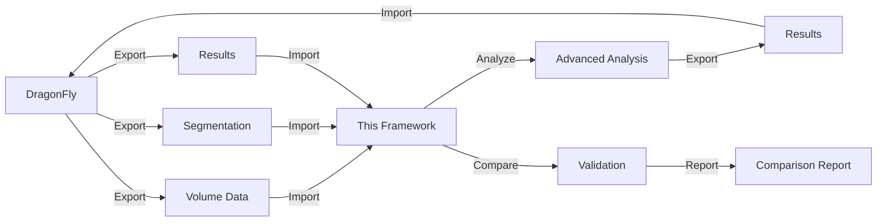
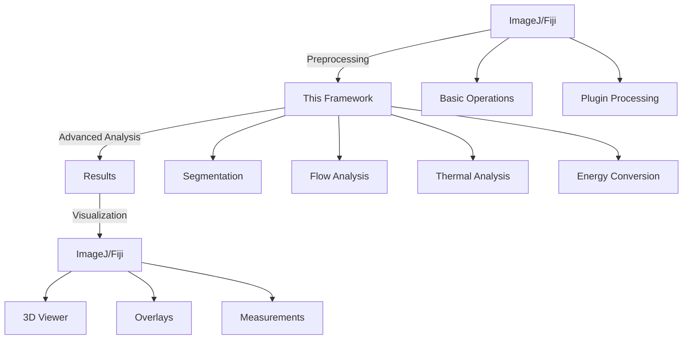
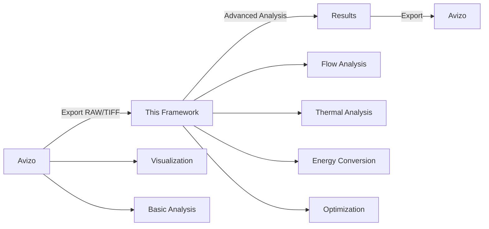
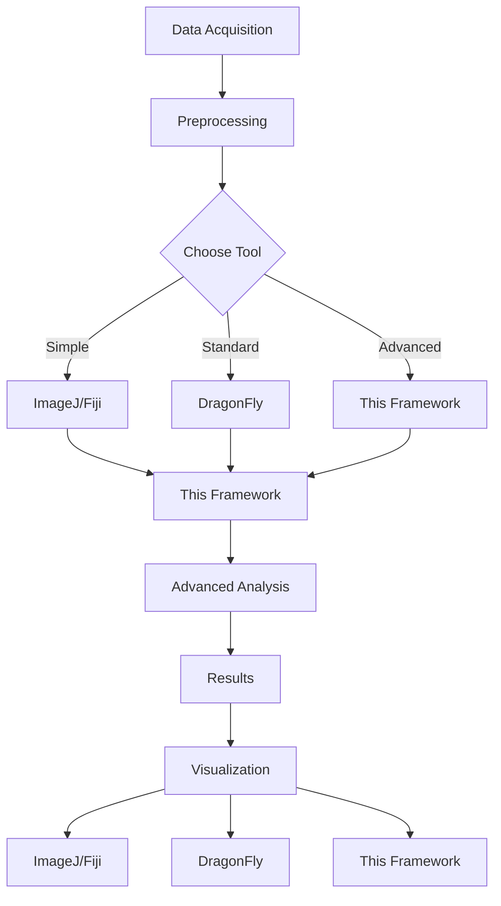

# External Image Analysis Tools

This document provides information about external image analysis tools, their comparison with this framework, and integration capabilities.

## Overview

The XCT Thermomagnetic Analysis Framework can work alongside or integrate with various external tools commonly used in XCT and image analysis research.

## Tool Comparison

### Comparison Matrix

| Feature | This Framework | DragonFly | ImageJ/Fiji | Avizo | VGStudio MAX |
|---------|---------------|-----------|-------------|-------|--------------|
| **Segmentation** | ✅ Otsu, Adaptive, Multi-threshold | ✅ Multiple methods | ✅ Plugins | ✅ Advanced | ✅ Advanced |
| **3D Visualization** | ✅ PyVista, Matplotlib | ✅ Built-in | ✅ 3D Viewer | ✅ Advanced | ✅ Advanced |
| **Morphological Operations** | ✅ Complete | ✅ Complete | ✅ Plugins | ✅ Complete | ✅ Complete |
| **Porosity Analysis** | ✅ Comprehensive | ✅ Basic | ⚠️ Plugins | ✅ Advanced | ✅ Advanced |
| **Flow Analysis** | ✅ Complete | ❌ | ❌ | ⚠️ Limited | ⚠️ Limited |
| **Thermal Analysis** | ✅ Complete | ❌ | ❌ | ❌ | ❌ |
| **Energy Conversion** | ✅ Complete | ❌ | ❌ | ❌ | ❌ |
| **Sensitivity Analysis** | ✅ Complete | ❌ | ❌ | ❌ | ❌ |
| **Virtual Experiments** | ✅ Complete | ❌ | ❌ | ❌ | ❌ |
| **Batch Processing** | ✅ Complete | ⚠️ Limited | ⚠️ Scripts | ⚠️ Limited | ⚠️ Limited |
| **Statistical Analysis** | ✅ Advanced | ⚠️ Basic | ⚠️ Plugins | ⚠️ Basic | ⚠️ Basic |
| **Reproducibility** | ✅ Built-in | ⚠️ Manual | ⚠️ Manual | ⚠️ Manual | ⚠️ Manual |
| **Python Integration** | ✅ Native | ⚠️ Limited | ✅ PyImageJ | ⚠️ Limited | ⚠️ Limited |
| **Cost** | ✅ Free/Open Source | 💰 Commercial | ✅ Free | 💰 Commercial | 💰 Commercial |
| **Customization** | ✅ Full | ⚠️ Limited | ✅ Plugins | ⚠️ Limited | ⚠️ Limited |

**Legend:**
- ✅ = Full support
- ⚠️ = Limited/Partial support
- ❌ = Not available

## DragonFly Integration

### Overview

DragonFly is a commercial XCT analysis software commonly used in materials science research. This framework provides comprehensive integration with DragonFly.

### Integration Capabilities



### Import from DragonFly

```python
from src.integration.dragonfly_integration import (
    import_dragonfly_volume,
    import_dragonfly_segmentation,
    import_dragonfly_results
)

# Import volume from DragonFly
volume, metadata = import_dragonfly_volume(
    'dragonfly_data.raw',
    dimensions=(512, 512, 512),
    data_type='uint16',
    voxel_size=(0.1, 0.1, 0.1)
)

# Import segmentation
segmented, seg_metadata = import_dragonfly_segmentation(
    'dragonfly_segmentation.tiff'
)

# Import analysis results
results = import_dragonfly_results('dragonfly_results.csv')
```

### Export to DragonFly

```python
from src.integration.dragonfly_integration import (
    export_to_dragonfly_volume,
    export_segmentation_to_dragonfly,
    export_results_to_dragonfly
)

# Export volume
export_to_dragonfly_volume(
    volume=segmented,
    output_path='output.raw',
    voxel_size=(0.1, 0.1, 0.1),
    format='raw'
)

# Export segmentation
export_segmentation_to_dragonfly(
    volume=segmented,
    output_path='segmentation.raw',
    object_properties=object_props_df
)

# Export results
export_results_to_dragonfly(
    results=analysis_results,
    output_path='results.csv',
    format='csv'
)
```

### Validation Against DragonFly

```python
from src.quality.validation import compare_with_dragonfly

# Compare results with DragonFly
comparison = compare_with_dragonfly(
    our_results={
        'void_fraction': 0.25,
        'volume': 1000.0,
        'surface_area': 5000.0
    },
    dragonfly_results={
        'void_fraction': 0.24,
        'volume': 980.0,
        'surface_area': 4900.0
    }
)

print("Validation Results:")
print(f"  Void fraction difference: {comparison['void_fraction']['difference']:.4f}")
print(f"  Volume difference: {comparison['volume']['difference']:.2f}%")
print(f"  Agreement: {comparison['overall_agreement']:.2%}")
```

## ImageJ/Fiji Integration

### Overview

ImageJ and Fiji are popular open-source image analysis platforms with extensive plugin ecosystems.

### Using PyImageJ

```python
# Install: pip install pyimagej
import imagej

# Initialize ImageJ
ij = imagej.init()

# Load volume in ImageJ
ij_volume = ij.io().open('data/sample.tiff')

# Convert to numpy for this framework
volume_np = ij.py.from_java(ij_volume)

# Use this framework for analysis
from src.core.segmentation import otsu_threshold
segmented = otsu_threshold(volume_np)

# Convert back to ImageJ format if needed
segmented_ij = ij.py.to_java(segmented)
ij.ui().show(segmented_ij)
```

### Workflow Integration



### Example: Hybrid Workflow

```python
# 1. Preprocess in ImageJ (if preferred)
import imagej
ij = imagej.init()
ij_volume = ij.io().open('data/sample.tiff')

# 2. Convert and analyze in this framework
volume = ij.py.from_java(ij_volume)
from src.core.segmentation import otsu_threshold
segmented = otsu_threshold(volume)

# 3. Advanced analysis in this framework
from src.experimental.flow_analysis import comprehensive_flow_analysis
flow_results = comprehensive_flow_analysis(segmented, ...)

# 4. Visualize in ImageJ
segmented_ij = ij.py.to_java(segmented)
ij.ui().show(segmented_ij)
```

## Avizo Integration

### Overview

Avizo is a commercial 3D visualization and analysis software for scientific data.

### File Format Compatibility

```python
# Avizo uses various formats that this framework supports
from src.utils.utils import load_volume

# Load Avizo-compatible formats
volume, metadata = load_volume('avizo_data.raw', file_format='raw')
volume, metadata = load_volume('avizo_data.tiff', file_format='tiff')

# Analyze with this framework
from src.core.metrics import compute_all_metrics
metrics = compute_all_metrics(volume, metadata['voxel_size'])

# Export for Avizo
from src.utils.utils import save_volume
save_volume(segmented, 'output_for_avizo.raw', file_format='raw')
```

### Workflow



## VGStudio MAX Integration

### Overview

VGStudio MAX is a commercial software for CT data analysis and visualization.

### Integration Approach

```python
# VGStudio MAX exports to common formats
# This framework can import these formats

# Import from VGStudio MAX export
volume, metadata = load_volume(
    'vgstudio_export.raw',
    file_format='raw',
    dimensions=(512, 512, 512)
)

# Perform advanced analysis
from src.experimental.flow_analysis import comprehensive_flow_analysis
results = comprehensive_flow_analysis(volume, ...)

# Export results for VGStudio MAX
import pandas as pd
results_df = pd.DataFrame([results])
results_df.to_csv('vgstudio_results.csv', index=False)
```

## ITK/VTK Integration

### Overview

ITK (Insight Toolkit) and VTK (Visualization Toolkit) are powerful open-source libraries for image processing and visualization.

### Using ITK for Preprocessing

```python
# Install: pip install itk
import itk

# Load with ITK
reader = itk.ImageFileReader.New(FileName='data/sample.dcm')
reader.Update()
itk_image = reader.GetOutput()

# Convert to numpy
volume = itk.GetArrayFromImage(itk_image)

# Use this framework for analysis
from src.core.segmentation import otsu_threshold
segmented = otsu_threshold(volume)

# Convert back to ITK if needed
segmented_itk = itk.GetImageFromArray(segmented)
```

### Using VTK for Visualization

```python
# This framework uses PyVista (VTK-based) for 3D visualization
from src.core.visualization import visualize_3d_volume

# PyVista is built on VTK
visualize_3d_volume(segmented)

# Direct VTK access if needed
import pyvista as pv
pv_volume = pv.wrap(segmented)
pv_volume.plot()
```

## scikit-image Integration

### Overview

scikit-image is a Python library for image processing. This framework already uses it internally.

### Direct Usage

```python
from skimage import filters, morphology, measure

# Use scikit-image for preprocessing
from skimage.filters import gaussian
smoothed = gaussian(volume, sigma=1.0)

# Then use this framework
from src.core.segmentation import otsu_threshold
segmented = otsu_threshold(smoothed)

# Or use scikit-image segmentation
from skimage.segmentation import watershed
# ... then analyze with this framework
```

## OpenCV Integration

### Overview

OpenCV is a popular computer vision library. Can be used for preprocessing.

### Integration Example

```python
import cv2
import numpy as np

# Preprocess with OpenCV (for 2D slices)
for z in range(volume.shape[0]):
    slice_2d = volume[z, :, :]
    
    # OpenCV preprocessing
    denoised = cv2.fastNlMeansDenoising(slice_2d.astype(np.uint8))
    
    volume[z, :, :] = denoised

# Then use this framework
from src.core.segmentation import otsu_threshold
segmented = otsu_threshold(volume)
```

## Comparison: When to Use Which Tool

### Use This Framework When:

✅ **You need experimental-specific analysis**
- Flow analysis (tortuosity, flow resistance)
- Thermal analysis (heat transfer, thermal resistance)
- Energy conversion analysis (power output, efficiency)

✅ **You need advanced statistical analysis**
- Sensitivity analysis (Sobol indices, Morris screening)
- Virtual experiments (DoE, optimization)
- Comparative analysis (batch processing, statistical tests)

✅ **You need reproducibility**
- Provenance tracking
- Configuration management
- Reproducibility packages

✅ **You need Python integration**
- Scripting and automation
- Integration with other Python tools
- Custom analysis workflows

✅ **You need cost-effective solution**
- Open-source and free
- No license fees
- Full customization

### Use DragonFly When:

✅ **You need commercial support**
- Professional support
- Training and documentation
- Regular updates

✅ **You need standard XCT analysis**
- Basic segmentation and metrics
- Standard morphological operations
- Built-in visualization

### Use ImageJ/Fiji When:

✅ **You need extensive plugin ecosystem**
- Thousands of plugins available
- Community-developed tools
- Rapid prototyping

✅ **You prefer GUI-based workflow**
- Interactive analysis
- Visual parameter adjustment
- Point-and-click interface

### Use Avizo/VGStudio MAX When:

✅ **You need advanced 3D visualization**
- High-quality rendering
- Advanced visualization features
- Professional presentation graphics

✅ **You have budget for commercial software**
- License available
- Need commercial support

## Hybrid Workflows

### Recommended Hybrid Approach



### Example Hybrid Workflow

```python
# Step 1: Preprocess in ImageJ (if preferred)
import imagej
ij = imagej.init()
ij_volume = ij.io().open('data/sample.tiff')
volume = ij.py.from_java(ij_volume)

# Step 2: Basic segmentation in DragonFly (if available)
# Export from DragonFly, then import:
# segmented = import_dragonfly_segmentation('dragonfly_seg.raw')

# Step 3: Advanced analysis in this framework
from src.experimental.flow_analysis import comprehensive_flow_analysis
flow_results = comprehensive_flow_analysis(segmented, ...)

from src.experimental.thermal_analysis import comprehensive_thermal_analysis
thermal_results = comprehensive_thermal_analysis(segmented, ...)

# Step 4: Validate against DragonFly
from src.quality.validation import compare_with_dragonfly
validation = compare_with_dragonfly(our_results, dragonfly_results)

# Step 5: Visualize in preferred tool
# Option A: This framework (PyVista)
from src.core.visualization import visualize_3d_volume
visualize_3d_volume(segmented)

# Option B: ImageJ
segmented_ij = ij.py.to_java(segmented)
ij.ui().show(segmented_ij)

# Option C: Export for Avizo/VGStudio MAX
save_volume(segmented, 'for_avizo.raw', file_format='raw')
```

## File Format Compatibility

### Supported Import Formats

| Format | Extension | Tool Compatibility |
|--------|-----------|-------------------|
| DICOM | .dcm, .dicom | ✅ All tools |
| TIFF | .tif, .tiff | ✅ All tools |
| RAW | .raw | ✅ DragonFly, Avizo, VGStudio |
| NIfTI | .nii, .nii.gz | ✅ Medical tools |
| MetaImage | .mhd, .mha | ✅ ITK-based tools |
| NumPy | .npy, .npz | ✅ Python tools |
| CSV | .csv | ✅ All tools (segmented data) |

### Export Formats

This framework can export to all formats that external tools can import, enabling seamless workflow integration.

## Best Practices for Tool Integration

### 1. Use Standard File Formats
```python
# Prefer standard formats for interoperability
save_volume(volume, 'output.tiff', file_format='tiff')  # ✅ Good
save_volume(volume, 'output.raw', file_format='raw')    # ⚠️ Requires metadata
```

### 2. Preserve Metadata
```python
# Always preserve voxel size and other metadata
metadata = {
    'voxel_size': (0.1, 0.1, 0.1),
    'unit': 'mm',
    'source': 'dragonfly'
}
save_volume(volume, 'output.tiff', metadata=metadata)
```

### 3. Validate Results
```python
# Always validate against known tools when possible
comparison = compare_with_dragonfly(our_results, dragonfly_results)
if comparison['overall_agreement'] < 0.95:
    print("Warning: Significant differences detected")
```

### 4. Document Workflow
```python
# Document which tools were used
from src.quality.reproducibility import track_analysis_provenance

provenance = track_analysis_provenance(
    analysis_type='hybrid_workflow',
    tools_used=['DragonFly', 'This Framework', 'ImageJ'],
    workflow_steps=['DragonFly segmentation', 'Framework flow analysis']
)
```

## Migration Guide

### From DragonFly to This Framework

1. **Export data from DragonFly**
   - Export volume as RAW or TIFF
   - Export segmentation as RAW or TIFF
   - Export results as CSV

2. **Import into this framework**
   ```python
   volume = import_dragonfly_volume('exported.raw', ...)
   segmented = import_dragonfly_segmentation('segmentation.raw')
   ```

3. **Run advanced analysis**
   ```python
   # Use framework's advanced capabilities
   flow_results = comprehensive_flow_analysis(...)
   ```

4. **Validate results**
   ```python
   # Compare with DragonFly results
   comparison = compare_with_dragonfly(...)
   ```

### From ImageJ to This Framework

1. **Export from ImageJ**
   - Save as TIFF or use PyImageJ

2. **Import and analyze**
   ```python
   import imagej
   ij = imagej.init()
   volume = ij.py.from_java(ij.io().open('data.tiff'))
   # Use this framework for advanced analysis
   ```

## Resources

- **DragonFly**: https://www.theobjects.com/dragonfly/
- **ImageJ/Fiji**: https://imagej.net/
- **Avizo**: https://www.thermofisher.com/avizo
- **VGStudio MAX**: https://www.volumegraphics.com/
- **ITK**: https://itk.org/
- **VTK**: https://vtk.org/
- **scikit-image**: https://scikit-image.org/
- **OpenCV**: https://opencv.org/

## Summary

This framework complements external tools by providing:
- **Advanced experimental analysis** not available in standard tools
- **Statistical and optimization capabilities**
- **Reproducibility framework**
- **Python-native integration**
- **Cost-effective solution**

Use external tools for:
- **Preprocessing** (if preferred)
- **Standard visualization** (if preferred)
- **Commercial support** (if needed)

The framework integrates seamlessly with all major XCT analysis tools, enabling hybrid workflows that leverage the strengths of each tool.

