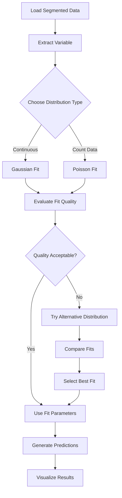
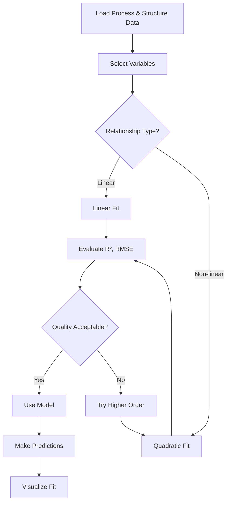

# Statistical Fitting Guide

This document provides comprehensive guidance on using the statistical fitting capabilities in the XCT Thermomagnetic Analysis Framework.

## Overview

The framework provides robust statistical fitting capabilities for analyzing XCT data distributions and relationships. These tools help you:

- **Characterize distributions** of structural metrics (pore sizes, filament diameters, etc.)
- **Model relationships** between process parameters and structural properties
- **Compare different distributions** to find the best fit
- **Generate predictions** from fitted models
- **Evaluate fit quality** using multiple statistical metrics

## Available Fitting Methods

### Distribution Fitting

#### 1. Gaussian (Normal) Distribution

Fits a normal distribution to your data. Ideal for:
- Pore size distributions
- Filament diameter distributions
- Any metric that follows a bell curve

```python
from src.preprocessing.statistics import fit_gaussian

# Fit Gaussian distribution to pore sizes
pore_sizes = segmented_data['pore_size'].values
fit_result = fit_gaussian(pore_sizes)

print(f"Mean: {fit_result['mean']:.3f} mm")
print(f"Std: {fit_result['std']:.3f} mm")
print(f"R²: {fit_result['r_squared']:.4f}")
print(f"KS p-value: {fit_result['ks_pvalue']:.4f}")
```

**Output Parameters:**
- `mean`: Mean of the distribution
- `std`: Standard deviation
- `variance`: Variance (std²)
- `median`: Median value
- `mode`: Mode (for normal distribution, equals mean)
- `r_squared`: Coefficient of determination
- `ks_statistic`: Kolmogorov-Smirnov test statistic
- `ks_pvalue`: KS test p-value (higher is better)
- `aic`: Akaike Information Criterion (lower is better)
- `bic`: Bayesian Information Criterion (lower is better)

#### 2. Poisson Distribution

Fits a Poisson distribution. Ideal for:
- Count data (number of pores, defects, etc.)
- Discrete events
- Rare events

```python
from src.preprocessing.statistics import fit_poisson

# Fit Poisson distribution to pore counts
pore_counts = segmented_data['pore_count'].values
fit_result = fit_poisson(pore_counts)

print(f"Lambda (mean): {fit_result['lambda']:.3f}")
print(f"Variance: {fit_result['variance']:.3f}")
print(f"KS p-value: {fit_result['ks_pvalue']:.4f}")
```

**Output Parameters:**
- `lambda`: Mean parameter (also equals variance for Poisson)
- `mean`: Mean value
- `variance`: Variance (equals lambda for Poisson)
- `std`: Standard deviation (√lambda)
- `median`: Median value
- `aic`, `bic`: Information criteria

### Regression Fitting

#### 3. Linear Regression

Fits a linear relationship: `y = a*x + b`

```python
from src.preprocessing.statistics import fit_linear

# Fit linear relationship between temperature and void fraction
temperatures = process_data['extrusion_temp'].values
void_fractions = structure_data['void_fraction'].values

fit_result = fit_linear(temperatures, void_fractions)

print(f"Slope: {fit_result['slope']:.6f}")
print(f"Intercept: {fit_result['intercept']:.6f}")
print(f"R²: {fit_result['r_squared']:.4f}")
print(f"RMSE: {fit_result['rmse']:.6f}")
```

**Output Parameters:**
- `slope`: Slope coefficient (a)
- `intercept`: Y-intercept (b)
- `r_value`: Correlation coefficient
- `r_squared`: Coefficient of determination
- `p_value`: Statistical significance
- `std_err`: Standard error of slope
- `rmse`: Root Mean Squared Error
- `mae`: Mean Absolute Error

#### 4. Quadratic Regression

Fits a quadratic relationship: `y = a*x² + b*x + c`

```python
from src.preprocessing.statistics import fit_quadratic

# Fit quadratic relationship
fit_result = fit_quadratic(temperatures, void_fractions)

print(f"a (x² coefficient): {fit_result['a']:.6f}")
print(f"b (x coefficient): {fit_result['b']:.6f}")
print(f"c (constant): {fit_result['c']:.6f}")
print(f"R²: {fit_result['r_squared']:.4f}")
```

**Output Parameters:**
- `a`: Quadratic coefficient (x² term)
- `b`: Linear coefficient (x term)
- `c`: Constant term
- `a_err`, `b_err`, `c_err`: Parameter uncertainties
- `r_squared`: Coefficient of determination
- `rmse`: Root Mean Squared Error
- `mae`: Mean Absolute Error

## Workflow Diagrams

### Distribution Fitting Workflow



### Regression Fitting Workflow



## Advanced Features

### Comparing Multiple Fits

Automatically compare multiple distribution types and select the best one:

```python
from src.preprocessing.statistics import compare_fits

# Compare Gaussian vs Poisson
comparison = compare_fits(
    data=pore_sizes,
    distributions=['gaussian', 'poisson']
)

print(f"Best fit: {comparison['best_distribution']}")
print(f"Best AIC: {comparison['best_fit']['aic']:.2f}")

# View all comparisons
for dist, metrics in comparison['comparison'].items():
    print(f"\n{dist}:")
    print(f"  AIC: {metrics['aic']:.2f}")
    print(f"  BIC: {metrics['bic']:.2f}")
    print(f"  R²: {metrics['r_squared']:.4f}")
```

### Evaluating Fit Quality

Get detailed quality assessment of your fit:

```python
from src.preprocessing.statistics import evaluate_fit_quality

quality = evaluate_fit_quality(fit_result)

print(f"Quality: {quality['interpretation']}")
print(f"Good: {quality['good']}")
print(f"Acceptable: {quality['acceptable']}")
print(f"Poor: {quality['poor']}")

# View metrics
for metric, value in quality['metrics'].items():
    print(f"{metric}: {value:.4f}")
```

**Quality Criteria:**
- **Good**: R² > 0.95 or KS p-value > 0.05
- **Acceptable**: R² > 0.80 or KS p-value > 0.01
- **Poor**: Below acceptable thresholds

### Generating Predictions

Generate samples or predictions from fitted models:

```python
from src.preprocessing.statistics import generate_fit_samples, predict_from_fit

# Generate random samples from fitted distribution
samples = generate_fit_samples(fit_result, n_samples=1000)

# Predict values from fitted regression
new_temperatures = np.array([200, 220, 240])
predictions = predict_from_fit(fit_result, new_temperatures)

print(f"Predictions:")
for temp, pred in zip(new_temperatures, predictions):
    print(f"  {temp}°C → {pred:.4f}")
```

## Complete Example: Analyzing Pore Size Distribution

```python
import numpy as np
import matplotlib.pyplot as plt
from src.preprocessing.statistics import (
    fit_gaussian, compare_fits, evaluate_fit_quality,
    generate_fit_samples
)

# Load segmented data
segmented_data = load_segmented_data('data/sample.csv')

# Extract pore sizes
pore_sizes = segmented_data['pore_size'].values

# 1. Fit Gaussian distribution
gaussian_fit = fit_gaussian(pore_sizes)
print("Gaussian Fit:")
print(f"  Mean: {gaussian_fit['mean']:.3f} mm")
print(f"  Std: {gaussian_fit['std']:.3f} mm")
print(f"  R²: {gaussian_fit['r_squared']:.4f}")

# 2. Compare with Poisson (if appropriate)
comparison = compare_fits(
    pore_sizes,
    distributions=['gaussian', 'poisson']
)
print(f"\nBest fit: {comparison['best_distribution']}")

# 3. Evaluate quality
quality = evaluate_fit_quality(gaussian_fit)
print(f"\nFit Quality: {quality['interpretation']}")

# 4. Generate samples for visualization
samples = generate_fit_samples(gaussian_fit, n_samples=1000)

# 5. Visualize
fig, axes = plt.subplots(1, 2, figsize=(12, 5))

# Histogram of data
axes[0].hist(pore_sizes, bins=50, density=True, alpha=0.7, label='Data')
x = np.linspace(pore_sizes.min(), pore_sizes.max(), 100)
from scipy import stats
y = stats.norm.pdf(x, gaussian_fit['mean'], gaussian_fit['std'])
axes[0].plot(x, y, 'r-', linewidth=2, label='Gaussian Fit')
axes[0].set_xlabel('Pore Size (mm)')
axes[0].set_ylabel('Density')
axes[0].legend()
axes[0].set_title('Pore Size Distribution')

# Q-Q plot
from scipy import stats
stats.probplot(pore_sizes, dist="norm", plot=axes[1])
axes[1].set_title('Q-Q Plot (Gaussian)')

plt.tight_layout()
plt.show()
```

## Complete Example: Process-Structure Relationship

```python
import numpy as np
import matplotlib.pyplot as plt
from src.preprocessing.statistics import (
    fit_linear, fit_quadratic, compare_fits
)

# Load process and structure data
process_data = pd.read_csv('process_parameters.csv')
structure_data = pd.read_csv('structure_metrics.csv')

# Extract variables
temperatures = process_data['extrusion_temp'].values
void_fractions = structure_data['void_fraction'].values

# 1. Try linear fit
linear_fit = fit_linear(temperatures, void_fractions)
print("Linear Fit:")
print(f"  Slope: {linear_fit['slope']:.6f}")
print(f"  Intercept: {linear_fit['intercept']:.6f}")
print(f"  R²: {linear_fit['r_squared']:.4f}")

# 2. Try quadratic fit
quadratic_fit = fit_quadratic(temperatures, void_fractions)
print("\nQuadratic Fit:")
print(f"  a: {quadratic_fit['a']:.6f}")
print(f"  b: {quadratic_fit['b']:.6f}")
print(f"  c: {quadratic_fit['c']:.6f}")
print(f"  R²: {quadratic_fit['r_squared']:.4f}")

# 3. Compare fits
if quadratic_fit['r_squared'] > linear_fit['r_squared']:
    print("\n✅ Quadratic fit is better")
    best_fit = quadratic_fit
else:
    print("\n✅ Linear fit is better")
    best_fit = linear_fit

# 4. Visualize
plt.figure(figsize=(10, 6))
plt.scatter(temperatures, void_fractions, alpha=0.6, label='Data')

# Plot linear fit
x_line = np.linspace(temperatures.min(), temperatures.max(), 100)
y_linear = linear_fit['slope'] * x_line + linear_fit['intercept']
plt.plot(x_line, y_linear, 'r--', label=f"Linear (R²={linear_fit['r_squared']:.3f})")

# Plot quadratic fit
y_quad = (quadratic_fit['a'] * x_line**2 + 
          quadratic_fit['b'] * x_line + 
          quadratic_fit['c'])
plt.plot(x_line, y_quad, 'g-', label=f"Quadratic (R²={quadratic_fit['r_squared']:.3f})")

plt.xlabel('Extrusion Temperature (°C)')
plt.ylabel('Void Fraction')
plt.legend()
plt.title('Process-Structure Relationship')
plt.grid(True, alpha=0.3)
plt.show()
```

## Integration with Notebooks

### In Data Explorer Notebook

The `01_XCT_Data_Explorer.ipynb` notebook includes a dedicated **Statistical Fitting** tab:

```python
# The widget automatically provides:
# - Distribution selection (Gaussian, Poisson)
# - Variable selection from segmented data
# - Fit quality metrics
# - Visualization of fit
# - Comparison of multiple distributions
```

### In Comparative Analysis Notebook

The `03_Comparative_Analysis_Batch_Processing.ipynb` uses fitting for:

- **Batch comparison**: Fit distributions for each batch
- **Trend analysis**: Fit relationships across process parameters
- **Quality assessment**: Evaluate fit quality for all samples

## Interpretation Guidelines

### Distribution Fitting

**Gaussian Distribution:**
- ✅ **Good fit** when: R² > 0.95, KS p-value > 0.05
- ⚠️ **Acceptable** when: R² > 0.80, KS p-value > 0.01
- ❌ **Poor fit** when: Below acceptable thresholds

**Poisson Distribution:**
- Use for count data (integers ≥ 0)
- Mean should equal variance (check this!)
- Good for rare events

### Regression Fitting

**Linear Regression:**
- ✅ **Good fit** when: R² > 0.95, RMSE small relative to data range
- ⚠️ **Acceptable** when: R² > 0.80
- ❌ **Poor fit** when: R² < 0.80 (try quadratic or other models)

**Quadratic Regression:**
- Use when relationship is curved
- Compare R² with linear fit
- Check if quadratic term is significant

### Model Selection

**AIC/BIC Guidelines:**
- Lower AIC/BIC = Better model
- Difference > 2 = Significant improvement
- Compare models with same data

**R² Guidelines:**
- R² > 0.95: Excellent fit
- R² > 0.80: Good fit
- R² > 0.60: Acceptable fit
- R² < 0.60: Poor fit (try different model)

## Common Use Cases

### 1. Pore Size Distribution Analysis

```python
# Analyze pore size distribution
pore_sizes = segmented_data['pore_size'].values
fit = fit_gaussian(pore_sizes)

# Interpret results
print(f"Average pore size: {fit['mean']:.3f} ± {fit['std']:.3f} mm")
print(f"95% of pores between: "
      f"{fit['mean'] - 2*fit['std']:.3f} and "
      f"{fit['mean'] + 2*fit['std']:.3f} mm")
```

### 2. Process Parameter Optimization

```python
# Find optimal temperature for minimum porosity
temperatures = np.array([200, 210, 220, 230, 240])
void_fractions = np.array([0.25, 0.22, 0.20, 0.23, 0.26])

# Fit quadratic to find minimum
fit = fit_quadratic(temperatures, void_fractions)

# Find minimum (derivative = 0)
optimal_temp = -fit['b'] / (2 * fit['a'])
print(f"Optimal temperature: {optimal_temp:.1f}°C")
```

### 3. Quality Control

```python
# Compare distributions across batches
batch_a = batch_results['batch_a']['pore_sizes']
batch_b = batch_results['batch_b']['pore_sizes']

fit_a = fit_gaussian(batch_a)
fit_b = fit_gaussian(batch_b)

# Check if means are significantly different
mean_diff = abs(fit_a['mean'] - fit_b['mean'])
std_pooled = np.sqrt((fit_a['std']**2 + fit_b['std']**2) / 2)

if mean_diff > 2 * std_pooled:
    print("⚠️ Significant difference between batches")
else:
    print("✅ Batches are similar")
```

## Best Practices

### 1. Data Preparation

```python
# Always clean data before fitting
data_clean = data[np.isfinite(data)]  # Remove NaN/Inf
data_clean = data_clean[data_clean > 0]  # Remove invalid values

# Check data range
print(f"Data range: {data_clean.min():.3f} to {data_clean.max():.3f}")
print(f"Number of points: {len(data_clean)}")
```

### 2. Model Selection

```python
# Always compare multiple models
comparison = compare_fits(
    data,
    distributions=['gaussian', 'poisson']
)

# Select best based on AIC
best = comparison['best_distribution']
print(f"Best model: {best}")
```

### 3. Validation

```python
# Split data for validation
from sklearn.model_selection import train_test_split

train_data, test_data = train_test_split(data, test_size=0.2)

# Fit on training data
fit = fit_gaussian(train_data)

# Validate on test data
quality = evaluate_fit_quality(fit)
print(f"Fit quality: {quality['interpretation']}")
```

### 4. Visualization

Always visualize your fits:

```python
# Histogram with fit overlay
plt.hist(data, bins=50, density=True, alpha=0.7, label='Data')
x = np.linspace(data.min(), data.max(), 100)
y = stats.norm.pdf(x, fit['mean'], fit['std'])
plt.plot(x, y, 'r-', linewidth=2, label='Fit')
plt.legend()
plt.show()
```

## Troubleshooting

### Problem: Poor Fit Quality

**Solutions:**
1. Try different distribution types
2. Check for outliers (remove if appropriate)
3. Transform data (log, sqrt, etc.)
4. Use weighted fitting if data has uncertainties

### Problem: Convergence Issues

**Solutions:**
1. Provide initial parameter guesses
2. Check data range (normalize if needed)
3. Increase number of data points
4. Try simpler model (linear instead of quadratic)

### Problem: Unrealistic Parameters

**Solutions:**
1. Check data units and ranges
2. Verify data cleaning
3. Use parameter bounds if available
4. Validate with domain knowledge

## Summary

The statistical fitting capabilities provide:

✅ **Distribution fitting** (Gaussian, Poisson)  
✅ **Regression fitting** (Linear, Quadratic)  
✅ **Model comparison** (AIC, BIC, R²)  
✅ **Quality evaluation** (Multiple metrics)  
✅ **Prediction generation** (Samples, values)  
✅ **Visualization support** (Ready for plotting)

Use these tools to:
- Characterize structural properties
- Model process-structure relationships
- Optimize process parameters
- Perform quality control
- Generate predictions

For more examples, see the Jupyter notebooks in the `notebooks/` directory.

