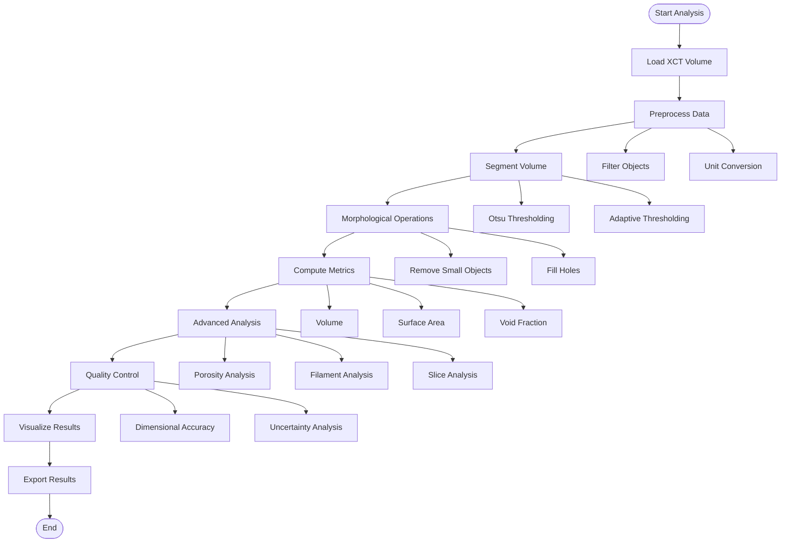
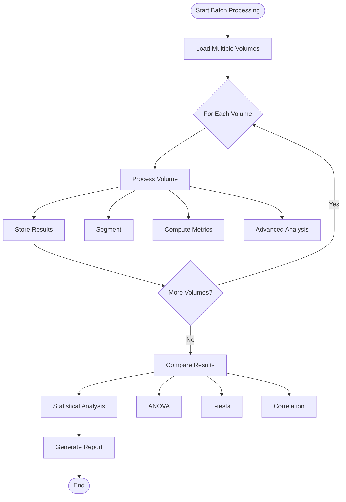
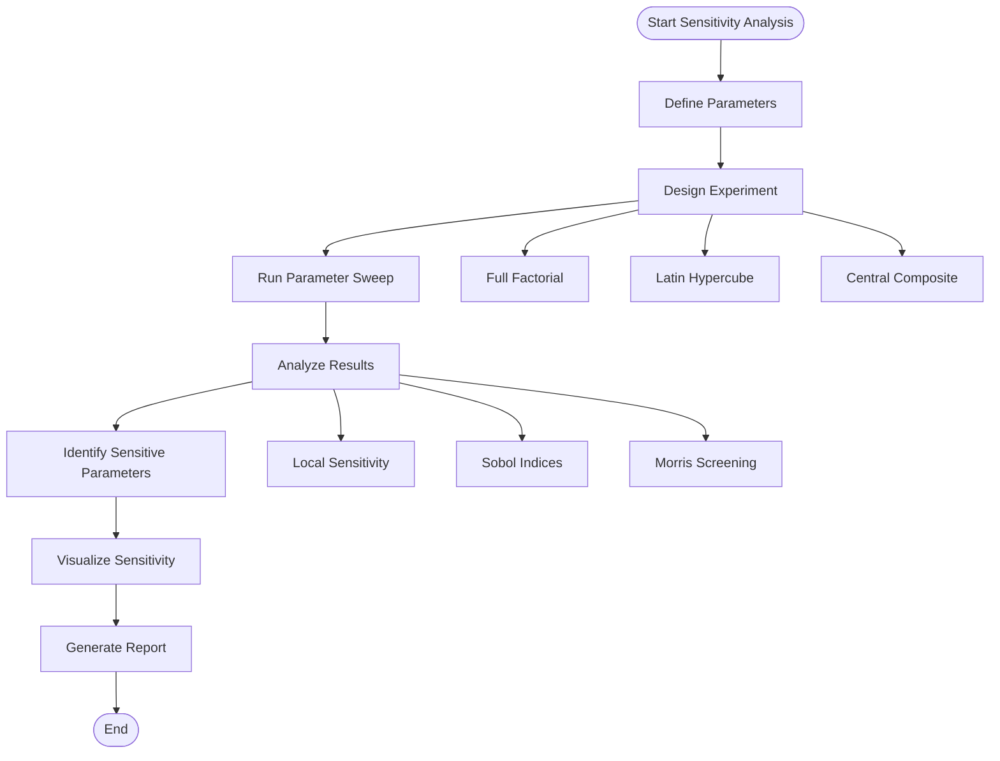
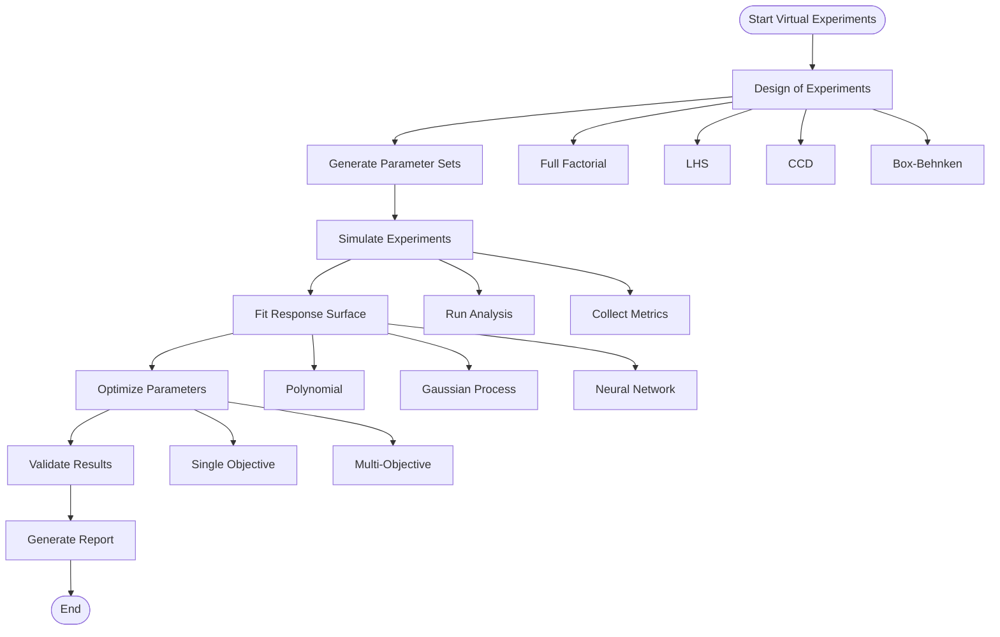
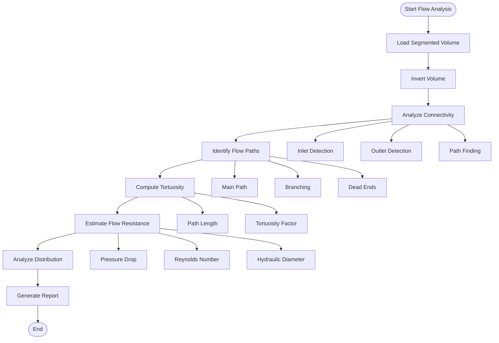
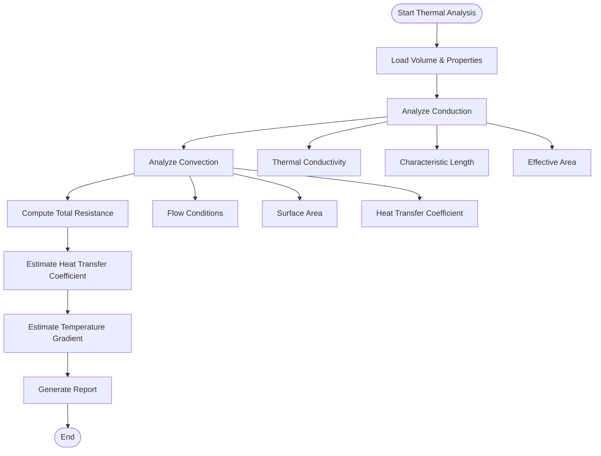
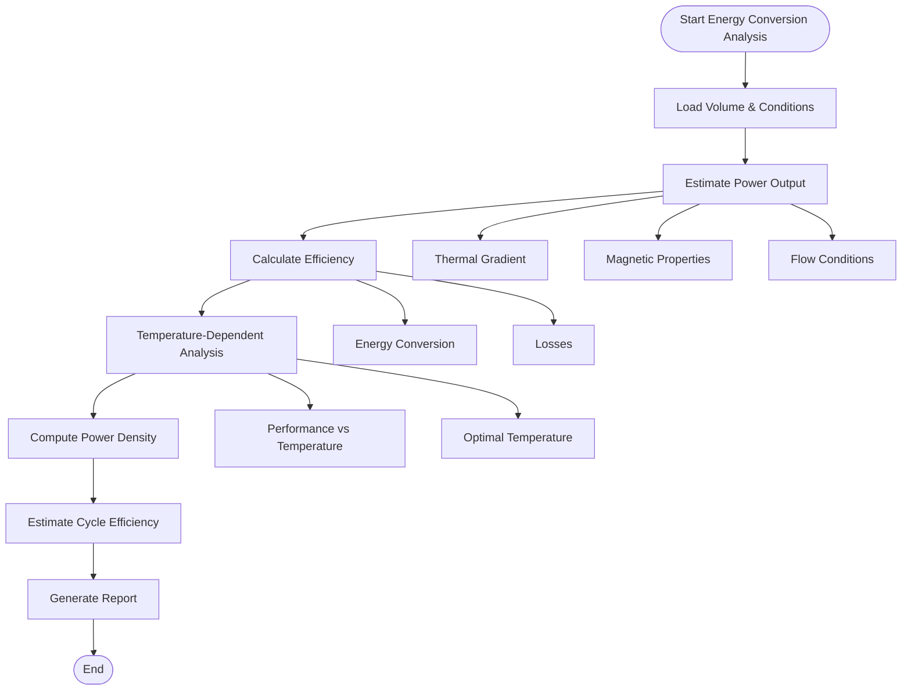
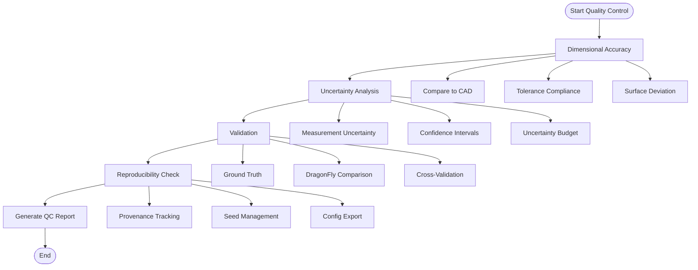
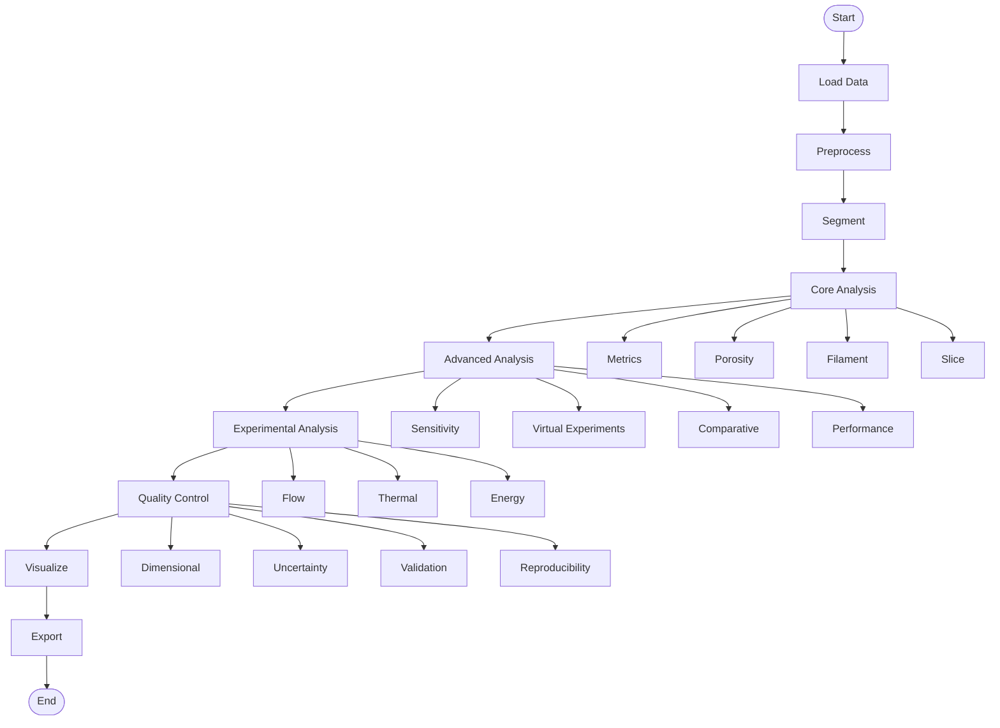

# Workflows

This document describes common workflows for using the XCT Thermomagnetic Analysis Framework, with visual flowcharts using Mermaid.

## Standard Analysis Workflow



## Batch Processing Workflow



## Sensitivity Analysis Workflow



## Virtual Experiments Workflow



## Flow Analysis Workflow



## Thermal Analysis Workflow



## Energy Conversion Analysis Workflow



## Quality Control Workflow



## Complete Analysis Pipeline



## Code Examples

### Standard Analysis

```python
from src.analyzer import XCTAnalyzer
from src.core.segmentation import otsu_threshold
from src.core.metrics import compute_all_metrics

# Initialize
analyzer = XCTAnalyzer(voxel_size=(0.1, 0.1, 0.1))

# Load and segment
volume, metadata = analyzer.load_volume('data/sample.dcm')
segmented = otsu_threshold(volume)

# Compute metrics
metrics = compute_all_metrics(segmented, (0.1, 0.1, 0.1))
```

### Batch Processing

```python
from src.analysis.comparative_analysis import batch_analyze

# Analyze multiple samples
results = batch_analyze(
    volume_paths=['data/sample1.dcm', 'data/sample2.dcm'],
    voxel_size=(0.1, 0.1, 0.1)
)
```

### Sensitivity Analysis

```python
from src.analysis.sensitivity_analysis import parameter_sweep

# Parameter sweep
results = parameter_sweep(
    base_volume=volume,
    parameters={'threshold': [0.3, 0.4, 0.5]},
    metric_function=compute_all_metrics
)
```

See [Tutorials](tutorials.md) for more detailed examples.

